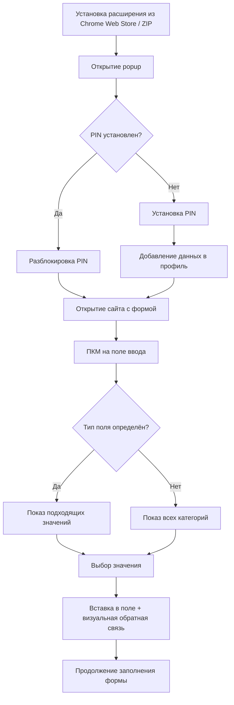

# AccountsHelper — Business Requirements Document (BRD)

## Цель доработки

Создать браузерное расширение AccountsHelper для Google Chrome, которое позволит пользователю хранить в зашифрованном виде часто используемые личные данные (email, кошельки, социальные сети, контакты, имя) и быстро вставлять их в web-формы через контекстное меню по правой кнопке мыши с автоопределением типа поля.

## Текущая ситуация AS-IS

- Пользователь часто заполняет формы для airdrop, whitelist, waitlist, регистраций.
- Данные (email, EVM/BTC-адреса, Discord, Telegram, X, телефон, имя) хранятся в разных местах: заметках, буфере обмена, мессенджерах.
- Процесс заполнения форм ручной и медленный: нужно переключаться между окнами, искать нужный адрес, копировать и вставлять.
- Ошибки при копировании адресов кошельков могут привести к потере средств или отказу в зачислении.
- Существующие менеджеры паролей (Bitwarden, 1Password) умеют заполнять логины/пароли/карты, но плохо подходят для кастомных полей (кошельки, Discord, X, Telegram).
- Для проекта не существует ни кода, ни архитектуры; разработка начинается с нуля.

## Желаемое состояние TO-BE

- Пользователь устанавливает расширение AccountsHelper в Chrome один раз.
- При первом запуске устанавливается PIN, под которым шифруется профиль.
- Пользователь добавляет в профиль:
  - email (один или несколько),
  - EVM-адреса кошельков (Ethereum, BSC, Polygon, Arbitrum, Optimism и др.),
  - Bitcoin-адреса,
  - Discord handle (`@username`),
  - Telegram handle (`@username`),
  - X / Twitter handle (`@username`),
  - телефон,
  - имя (first name / last name),
  - nickname.
- При клике правой кнопкой мыши на поле ввода на любой странице появляется контекстное меню AccountsHelper.
- Расширение автоматически определяет тип поля по атрибутам (`name`, `id`, `placeholder`, `autocomplete`, `aria-label`, `inputmode`, `type`) и соседним `<label>`.
- Пользователь выбирает подходящее сохранённое значение из подменю — и оно вставляется в поле с корректными событиями `input`/`change`.
- Если автоопределение не сработало, пользователь может вручную выбрать любое сохранённое значение.
- Профиль можно экспортировать в зашифрованный JSON и импортировать обратно.

## Бизнес-ценность

- Сокращение времени заполнения типовых форм с нескольких минут до нескольких секунд.
- Снижение количества ошибок при вводе адресов кошельков и контактов.
- Повышение удобства работы с криптовалютными активностями (airdrop, whitelist).
- Локальное зашифрованное хранилище гарантирует конфиденциальность без необходимости доверять облачному сервису.

## Границы

### В scope (MVP)

- Chrome-расширение Manifest V3.
- Хранение данных локально в `chrome.storage.local` в зашифрованном виде.
- Разблокировка и шифрование через PIN.
- Поддерживаемые типы данных: email, EVM address, BTC address, Discord, Telegram, X, phone, first name, last name, nickname.
- Контекстное меню по ПКМ с автоопределением поля.
- Вставка значений в `<input>`, `<textarea>` и `[contenteditable]`.
- Popup для управления профилем.
- Экспорт/импорт зашифрованного профиля в JSON.

### Out of scope (MVP)

- Поддержка Firefox, Safari, Edge (только Chrome).
- Облачная синхронизация или бэкенд.
- Автозаполнение всех полей формы без участия пользователя (auto-fill upon page load).
- Web3-подпись транзакций или подключение к dApps.
- OCR или визуальное распознавание полей.
- Генерация новых кошельков или seed-фраз.
- Распознавание CAPTCHA.

## Допущения и ограничения

- Пользователь использует Google Chrome версии, поддерживающей Manifest V3.
- Web Crypto API доступен в service worker и popup расширения.
- Пользователь несёт ответственность за безопасность PIN и резервные копии экспортированного профиля.
- Расширение не имеет права на автоматические сетевые запросы к внешним API.

## Глоссарий

| Термин | Описание |
|---|---|
| **EVM-адрес** | Адрес кошелька в сетях, совместимых с Ethereum Virtual Machine (Ethereum, BSC, Polygon, Arbitrum, Optimism и др.). Формат: 0x + 40 hex-символов. |
| **BTC-адрес** | Адрес кошелька Bitcoin. Поддерживаются legacy (1...), P2SH (3...), bech32 (bc1...). |
| **Handle** | Идентификатор пользователя в социальной сети, обычно в формате `@username`. |
| **Content script** | Скрипт расширения Chrome, выполняемый в контексте веб-страницы. |
| **Service worker** | Фоновый скрипт расширения Chrome MV3, обрабатывающий события. |
| **PIN** | Числовой или буквенно-цифровой код, используемый для разблокировки профиля и шифрования ключа. |

## User story

**US-01. Первичная настройка профиля**
> Я, как пользователь расширения, хочу при первом запуске установить PIN и добавить свои email и кошельки, чтобы расширение могло их использовать для заполнения форм.

*Acceptance criteria:*
- При первом открытии popup предлагается создать PIN.
- PIN вводится дважды; при несовпадении показывается ошибка.
- После установки PIN пользователь может добавить записи email и EVM-адреса.
- Данные сохраняются в зашифрованном виде.

**US-02. Быстрое заполнение поля кошелька**
> Я, как участник криптовалютных активностей, хочу кликнуть правой кнопкой на поле «Wallet address» и выбрать сохранённый адрес, чтобы не копировать его вручную.

*Acceptance criteria:*
- При ПКМ на поле ввода появляется меню AccountsHelper.
- Расширение определяет поле как EVM- или BTC-адрес.
- В подменю отображаются сохранённые адреса с псевдонимами.
- Выбранный адрес вставляется в поле и подсвечивается на 1 секунду.

**US-03. Заполнение поля без автоопределения**
> Я, как пользователь, хочу вставить любое сохранённое значение в поле, даже если расширение не смогло определить его тип, чтобы не терять функциональность на нестандартных формах.

*Acceptance criteria:*
- В контекстном меню есть пункт «Все данные» с категориями.
- Выбор категории показывает список сохранённых записей.
- Вставка работает для любого текстового поля.

**US-04. Экспорт профиля перед переустановкой**
> Я, как пользователь, хочу экспортировать зашифрованную копию профиля, чтобы восстановить данные после переустановки расширения.

*Acceptance criteria:*
- В popup есть раздел «Настройки → Экспорт профиля».
- Для экспорта требуется ввести PIN.
- Скачивается JSON-файл с зашифрованными данными.
- Импорт файла восстанавливает профиль после ввода PIN.

## Клиентский путь (CJM)

## Definition of Ready (DoR)

| # | Критерий | Обязательный | Статус |
|---|----------|--------------|--------|
| D1 | Business customer identified | да | ✅ Пользователь (Yuriy Gonzales Molina / vebster) |
| D2 | Problem stated (AS-IS + TO-BE) | да | ✅ |
| D3 | Goal stated | да | ✅ |
| D4 | User story with acceptance criteria | да | ✅ US-01 — US-04 |
| D5 | CJM/BPMN present | да | ✅ Mermaid-диаграмма |
| D6 | Stakeholders / departments listed | да | ✅ См. раздел заинтересованных сторон |
| D7 | Systems / services identified | да | ✅ Google Chrome, chrome.storage.local, Web Crypto API |

**DoR: 7/7 обязательных пройдено → ГОТОВ**

## Заинтересованные стороны и зависимости

| Роль | Представитель | Интерес |
|---|---|---|
| Product Owner / User | Yuriy Gonzales Molina (vebster) | Работающее расширение для личного использования и возможного публичного распространения |
| Architect / SA / Dev / Tester | Hermes Agent (пайплайн) | Создание корректных артефактов, кода и тестов |
| Chrome Web Store | Google | Публикация и модерация расширения |

## Нормативные требования

*REG-01.* Расширение должно соответствовать политикам Chrome Web Store Developer Program Policies, включая Privacy Policy и минимизацию запрашиваемых прав.

*REG-02.* Хранение и обработка персональных данных должна выполняться локально; передача данных третьим лицам запрещена без явного согласия пользователя.

## Бизнес-требования

| ID | Требование | Критерий приёмки | Приоритет |
|---|---|---|---|
| BR-01 | Расширение должно устанавливаться в Google Chrome с Manifest V3 | Установка из `.zip` или Chrome Web Store проходит без ошибок | Must |
| BR-02 | Пользователь должен устанавливать PIN при первом запуске | Popup требует PIN до первого сохранения данных; PIN вводится дважды | Must |
| BR-03 | Профиль должен храниться в зашифрованном виде | Данные в `chrome.storage.local` нельзя прочитать без PIN; используется AES-256-GCM | Must |
| BR-04 | Пользователь должен управлять записями профиля | CRUD для всех типов данных; валидация форматов | Must |
| BR-05 | ПКМ-меню должно предлагать вставку сохранённых данных | Меню появляется на полях ввода; содержит подменю с категориями | Must |
| BR-06 | Расширение должно автоопределять тип поля | Тесты на Google Forms / Typeform / кастомных HTML-формах проходят ≥ 80% | Must |
| BR-07 | Вставка должна корректно работать с React/Vue/Angular | События `input` и `change` триггерятся после вставки | Must |
| BR-08 | Пользователь должен иметь возможность экспортировать и импортировать профиль | Зашифрованный JSON экспортируется и импортируется с PIN | Should |

## Бизнес-правила

| ID | Правило |
|---|---|
| BRULE-01 | PIN должен содержать минимум 6 символов (цифры и/или буквы). |
| BRULE-02 | После 5 неправильных попыток ввода PIN профиль блокируется на 15 минут. |
| BRULE-03 | EVM-адрес должен проходить проверку checksum (EIP-55). |
| BRULE-04 | BTC-адрес должен соответствовать одному из форматов: legacy, P2SH, bech32. |
| BRULE-05 | Email должен соответствовать формату RFC 5322 (упрощённая проверка). |
| BRULE-06 | Discord, Telegram, X handles сохраняются с префиксом `@`, если пользователь его не указал. |
| BRULE-07 | Каждой записи можно назначить псевдоним длиной до 50 символов. |
| BRULE-08 | Только один адрес/запись каждого типа может быть отмечена как «по умолчанию». |

## Нефункциональные требования

| ID | Требование | Критерий |
|---|---|---|
| NFR-01 | Производительность | Контекстное меню появляется < 200 мс после ПКМ |
| NFR-02 | Производительность | Расшифровка профиля < 500 мс на современном ПК |
| NFR-03 | Безопасность | Ключ шифрования держится только в памяти service worker; удаляется при блокировке |
| NFR-04 | Безопасность | PIN не хранится в открытом виде; проверка через PBKDF2 / Argon2id |
| NFR-05 | Надёжность | При ошибке шифрования/дешифрования показывается понятное сообщение без падения расширения |
| NFR-06 | UX | Заполнение формы требует не более 3 кликов: ПКМ → категория → значение |
| NFR-07 | Доступность | Интерфейс popup и контекстного меню читаем при масштабе 100–150% |

## Риски

| ID | Риск | Вероятность | Влияние | Митигация |
|---|---|---|---|---|
| R-01 | Chrome Web Store отклонит расширение из-за шифрования или хранения кошельков | средняя | высокое | Подготовить чёткую Privacy Policy и минимальный набор прав |
| R-02 | Web Crypto API недоступен или ограничен в service worker MV3 | низкая | высокое | Проверить на раннем этапе, использовать popup/offscreen document при необходимости |
| R-03 | Content script может конфликтовать с сайтами, использующими CSP | средняя | среднее | Использовать только безопасные DOM-методы, не inline-скрипты |
| R-04 | Потеря PIN приводит к невозможности восстановить данные | средняя | высокое | Предупреждение при установке, рекомендация экспортировать резервную копию |
| R-05 | Автоопределение полей работает плохо на нестандартных формах | средняя | среднее | Fallback «Все данные» + расширяемый словарь паттернов |

## Предпосылки для системных требований

- Расширение разрабатывается на TypeScript.
- Сборка через Vite/Webpack/Rollup — выбор Architect.
- Chrome Manifest V3 обязателен.
- Web Crypto API доступен в современных версиях Chrome.
- Для тестирования потребуются тестовые HTML-страницы с формами (React, Vue, Angular, vanilla).
- Публикация в Chrome Web Store требует developer account и privacy policy.

## Среда разработки и развёртывания

| Этап | Среда |
|---|---|
| Разработка | Локальная машина `/home/hermes_ai/my_agent/AI-harness/projects/accounts-helper` |
| Сборка | Node.js + Vite/Webpack (уточнит Architect) |
| Тестирование | Chrome Dev/Canary, playwright/webextension-tester или ручное тестирование |
| Дистрибуция | Архив `.zip` для ручной установки и Chrome Web Store |
| Версионирование | GitHub `vebster88/AI-harness`, ветка `main` |

## Definition of Done (DoD)

| # | Критерий | Статус |
|---|---|---|
| DD1 | Все BRD-секции заполнены | ✅ |
| DD2 | Каждое BR имеет acceptance criteria | ✅ |
| DD3 | Каждое BRULE имеет источник/обоснование | ✅ |
| DD4 | Каждое REG имеет регуляторный источник | ✅ |
| DD5 | Нет блокирующих open questions | ✅ |
| DD6 | Заинтересованные стороны указаны | ✅ |
| DD7 | Предпосылки для системных требований заполнены | ✅ |
| DD8 | HUMAN GATE — бизнес-заказчик проверил BRD | ⏳ Ожидает апрува |
| DD9 | MD-файл сохранён в проекте | ✅ |

**DoD: 8/9**

## Open questions

Нет блокирующих вопросов.

## Следующий шаг

Согласование BRD с бизнес-заказчиком. После апрува — передача Architect для создания HLD.
