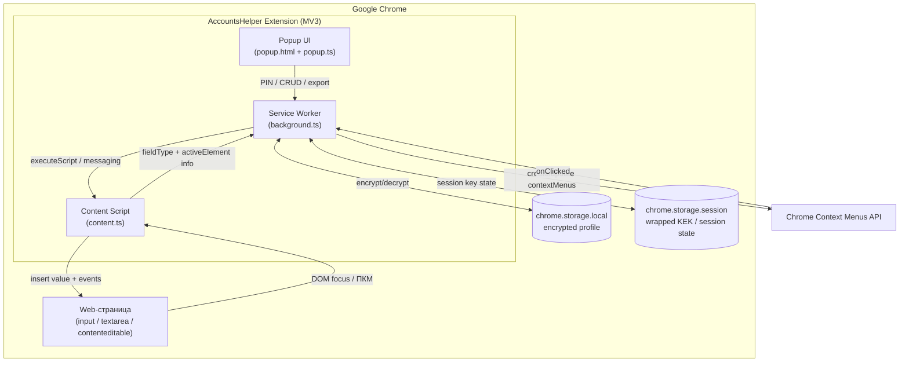

# AccountsHelper — High-Level Design Document (HLD)

## 1. Общие сведения

| Параметр | Значение |
|---|---|
| Название системы | AccountsHelper |
| Тип системы | Браузерное расширение Google Chrome, Manifest V3 |
| Язык реализации | TypeScript |
| Целевой браузер | Google Chrome (Manifest V3) |
| Источник требований | `BRD.md`, версия 1.0 |
| Границы релиза | MVP: локальное зашифрованное хранилище, PIN, контекстное меню, popup, экспорт/импорт JSON |
| Ответственный | Architect / Hermes Agent |

## 2. Резюме архитектуры

Расширение состоит из трёх основных исполняемых слоёв Chrome MV3:

1. **Service Worker (background)** — держит криптографический ключ в оперативной памяти, управляет контекстным меню, выполняет шифрование/дешифрование через Web Crypto API, координирует сообщения между popup и content script.
2. **Popup UI** — отвечает за первичную настройку PIN, CRUD профиля, разблокировку, экспорт/импорт, настройки.
3. **Content Script** — выполняется в контексте веб-страницы, определяет тип активного поля ввода по DOM-атрибутам, вставляет выбранное значение с корректной генерацией событий `input`/`change`, обеспечивает визуальную обратную связь.

Данные хранятся в `chrome.storage.local` **только в зашифрованном виде**. Ключ шифрования держится в `chrome.storage.session` и в памяти service worker; он уничтожается при закрытии браузера, принудительной блокировке или превышении лимита неправильных попыток PIN.

## 3. Архитектурная диаграмма



## 4. Компонентная модель

### 4.1 Service Worker (`src/background`)

| Модуль | Назначение | Связь с BRD |
|---|---|---|
| `lifecycle.ts` | Установка/обновление расширения, инициализация контекстного меню по умолчанию | BR-01, BR-05 |
|| `crypto-service.ts` | PBKDF2-SHA256, AES-256-GCM encrypt/decrypt, key derivation, checksum | BR-03, BRULE-04, NFR-03, NFR-04 |
| `session-key-store.ts` | Хранение развёрнутого ключа только в памяти service worker + `chrome.storage.session` | NFR-03 |
| `profile-service.ts` | CRUD профиля через зашифрованный blob в `chrome.storage.local` | BR-04 |
| `context-menu-service.ts` | Динамическое создание/обновление меню на основе активного поля и профиля | BR-05, BR-06, BR-07 |
| `pin-service.ts` | Проверка PIN, счётчик попыток, блокировка | BR-02, BRULE-01, BRULE-02, BRULE-03 |
| `export-import-service.ts` | Формирование и разбор зашифрованного JSON для экспорта/импорта | BR-08 |
| `messaging-router.ts` | Приём сообщений от popup и content script, маршрутизация | BR-05, BR-07 |

### 4.2 Popup (`src/popup`)

| Модуль | Назначение | Связь с BRD |
|---|---|---|
| `app.ts` | Точка входа, роутинг состояний (lock / setup / profile / settings) | BR-02, BR-04 |
| `pin-setup.ts` | Установка PIN (двойной ввод, валидация) | BR-02, BRULE-01 |
| `unlock.ts` | Разблокировка PIN, счётчик попыток | BRULE-02, BRULE-03 |
| `profile-editor.ts` | CRUD записей, валидация форматов, псевдонимы, флаги «по умолчанию» | BR-04, BRULE-04 — BRULE-09 |
| `export-import.ts` | UI экспорта/импорта зашифрованного JSON | BR-08 |
| `settings.ts` | Блокировка, смена PIN, очистка данных | BR-02, BRULE-03 |

### 4.3 Content Script (`src/content`)

| Модуль | Назначение | Связь с BRD |
|---|---|---|
| `field-detector.ts` | Определение типа поля по атрибутам и соседним `<label>` | BR-06 |
| `field-inserter.ts` | Безопасная вставка значения с событиями `input`, `change`, `focus`, `blur`, подсветка | BR-07 |
| `context-adapter.ts` | Слушание сообщений от service worker, получение активного элемента | BR-05 |

## 5. Потоки данных

### 5.1 Первичная настройка (US-01)

```text
Пользователь открывает popup
  → popup проверяет наличие encryptedProfile в chrome.storage.local
  → если профиля нет → экран установки PIN
  → PIN вводится дважды, валидируется (BRULE-01)
  → popup отправляет PIN в service worker
  → crypto-service генерирует соль, masterKey, salt, iv
  → service worker шифрует пустой профиль и сохраняет blob в chrome.storage.local
  → popup переключается в режим редактора профиля
```

### 5.2 Разблокировка сессии (BRULE-03)

```text
Пользователь открывает popup при наличии профиля
  → popup запрашивает PIN
  → PIN передаётся в service worker
  → pin-service проверяет счётчик неправильных попыток (BRULE-02)
  → crypto-service производит key derivation и расшифровывает профиль
  → развёрнутый ключ сохраняется в session-key-store
  → popup получает расшифрованный профиль и открывает редактор
```

### 5.3 Вставка через контекстное меню (US-02, US-03)

```text
Пользователь фокусирует поле ввода → ПКМ
  → Chrome Context Menus API вызывает service worker
  → context-menu-service запрашивает у content script тип активного поля
  → content.ts / field-detector.ts анализирует DOM и возвращает confidence + type
  → service worker строит динамическое меню:
       • если тип определён с высокой уверенностью → подменю с подходящими записями
       • иначе → пункт «Все данные» с категориями (US-03)
  → пользователь выбирает значение
  → service worker через chrome.scripting.executeScript или messaging
    вызывает field-inserter.ts в контексте страницы
  → field-inserter вставляет значение, диспатчит события, подсвечивает поле 1 сек
```

### 5.4 Экспорт/импорт (US-04)

```text
Пользователь открывает Settings → Экспорт профиля
  → требуется ввод PIN (если сессия не разблокирована)
  → service worker расшифровывает chrome.storage.local blob
  → export-import-service формирует JSON: { version, salt, iv, ciphertext, kdfParams, checksum }
  → popup инициирует скачивание файла через data URL / chrome.downloads

Импорт:
  → пользователь выбирает файл
  → popup читает JSON, отправляет в service worker
  → crypto-service проверяет version, kdfParams, checksum
  → PIN проверяется путём пробного расшифрования
  → при успехе blob сохраняется в chrome.storage.local
```

## 6. Модель безопасности

### 6.1 Угрозы и митигации

| Угроза | Митигация | Связь с BRD |
|---|---|---|
| Кража данных из `chrome.storage.local` | Всё хранится в AES-256-GCM ciphertext | BR-03, NFR-03 |
| Перехват ключа в памяти | Ключ держится только в service worker; стирается при блокировке/закрытии Chrome | NFR-03 |
| Подбор PIN | PIN 4 цифры; блокировка после 5 неправильных попыток (BRULE-02) | BR-02, NFR-04 |
|| Слабый KDF | **PBKDF2-SHA256 с 600 000 итераций** (Web Crypto API); Argon2id — roadmap | NFR-04 |
| Вставка на вредоносной странице | Контекстное меню доступно на всех URL; предупреждение на non-HTTPS в будущих версиях | REG-01, REG-02 |
| Повреждение/подмена экспорта | Контрольная сумма и version в JSON, проверка перед импортом | BR-08 |

### 6.2 Криптографическая схема

```text
Пользовательский PIN (4 цифры)
        |
        v
   PBKDF2-SHA256
   (salt, 600 000 итераций)
        |
        v
   KEK (Key Encryption Key) -- используется только для развёртывания DEK
        |
        v
   DEK (Data Encryption Key) -- 256 бит, генерируется случайно
        |
        +-- AES-256-GCM(iv) --> ciphertext профиля
        |
   Хранится в chrome.storage.local:
   {
     version: 1,
     kdf: "pbkdf2-sha256",
     kdfParams: { salt, iterations: 600000 },
     encryptedDek: "base64",        // DEK, зашифрованный KEK
     iv: "base64",
     ciphertext: "base64",
     checksum: "base64"             // SHA-256(encryptedProfileBlob)
   }
```

Развёрнутый DEK держится в памяти service worker и дублируется в `chrome.storage.session` в виде CryptoKey (не экспортируемого), чтобы пережить перезапуск service worker в рамках одной сессии браузера. При закрытии Chrome `chrome.storage.session` очищается.

### 6.3 Жизненный цикл ключа

| Состояние | Где находится ключ | Действие |
|---|---|---|
| Установлен PIN | Только в оперативной памяти SW | Создание DEK, шифрование профиля |
| Сессия разблокирована | Память SW + `chrome.storage.session` | Расшифровка по запросу popup/content |
| Блокировка из popup | Стирается из памяти и `chrome.storage.session` | Повторный ввод PIN |
| 5 неправильных попыток | Ключ не восстанавливается до перезапуска браузера | BRULE-02 |
| Закрытие Chrome | `chrome.storage.session` очищается браузером | BRULE-03 |

## 7. Проектирование хранилища

### 7.1 `chrome.storage.local`

| Ключ | Тип | Содержимое | Обоснование |
|---|---|---|---|
| `accountsHelper.encryptedProfile` | object | Зашифрованный blob профиля | BR-03, NFR-03 |
| `accountsHelper.meta` | object | Версия схемы, timestamp, флаг наличия профиля | BR-03 |

### 7.2 `chrome.storage.session`

|| Ключ | Тип | Содержимое |
|---|---|---|
|| `accountsHelper.dekHandle` | CryptoKey | Неэкспортируемый ключ AES-GCM |
|| `accountsHelper.pinAttempts` | number | Счётчик неправильных попыток |
|| `accountsHelper.locked` | boolean | Флаг блокировки |

### 7.3 Структура расшифрованного профиля

```typescript
interface Profile {
  version: number;
  createdAt: string;
  updatedAt: string;
  entries: ProfileEntry[];
}

interface ProfileEntry {
  id: string;              // uuid
  type: FieldType;         // email | evm | btc | discord | telegram | x | phone | firstName | lastName | nickname
  value: string;
  label?: string;           // псевдоним до 50 символов (BRULE-08)
  isDefault: boolean;       // только один default на тип (BRULE-09)
  createdAt: string;
  updatedAt: string;
}
```

### 7.4 Резервирование и миграция

- Версия схемы хранится в `meta.version`.
- При изменении схемы service worker выполняет миграцию после расшифровки.
- Экспорт JSON всегда содержит `version` и `kdfParams`, что позволяет импортировать на другой машине.

## 8. Стратегия автоопределения полей

### 8.1 Входные сигналы

Для активного элемента собирается текстовый вектор из:

- `el.type`
- `el.name`
- `el.id`
- `el.placeholder`
- `el.autocomplete`
- `el.aria-label`
- `el.inputmode`
- текста `<label for="id">`
- текста ближайшего `ancestor <label>`
- текста ближайшего `parentElement` (ограниченная глубина)

### 8.2 Карта паттернов

| Тип данных | Ключевые паттерны (name/id/placeholder/label) | Приоритет |
|---|---|---|
| `email` | email, e-mail, почта, mail | высокий |
| `evm` | wallet, address, evm, eth, bsc, polygon, arb, op, 0x, metamask | высокий |
| `btc` | bitcoin, btc, bc1 | высокий |
| `discord` | discord, discord_id, discord_username | высокий |
| `telegram` | telegram, tg, telegram_username | высокий |
| `x` | twitter, x, x_handle, twitter_handle | высокий |
| `phone` | phone, tel, mobile, номер | средний |
| `firstName` | first name, firstname, имя, fname | средний |
| `lastName` | last name, lastname, фамилия, lname | средний |
| `nickname` | nickname, nick, username, псевдоним | средний |

### 8.3 Алгоритм

1. Нормализация: lower-case, удаление знаков препинания, объединение camelCase.
2. Для каждого типа вычисляется score на основе количества и силы совпадений.
3. Если лучший score превышает порог `HIGH_CONFIDENCE` → показывается только соответствующая категория с записями.
4. Если score в диапазоне `LOW_CONFIDENCE` → показывается категория + пункт «Все данные».
5. Иначе → только «Все данные» (US-03).

### 8.4 Fallback

Пункт «Все данные» содержит подменю по категориям. Для каждой категории отображаются сохранённые записи с псевдонимом и превью значения. Это гарантирует работу на нестандартных формах (BR-06, R-05).

## 9. Пользовательский интерфейс

### 9.1 Выбор UI-фреймворка

**Рекомендация:** ванильный TypeScript + веб-компоненты / лёгкий шаблонизатор (например, lit-html или ручной DOM) вместо React/Vue/Angular.

| Критерий | Vanilla/Preact | React/Vue |
|---|---|---|
| Размер bundle | минимальный | существенно больше |
| Время запуска popup | < 100 мс | 200–500 мс |
| MV3 ограничения | нет runtime eval, CSP-friendly | нужен build |
| Сложность | низкая | избыточна для 4–6 экранов |

**Окончательный выбор:** ванильный TS с небольшим хелпером для рендеринга. Если в будущем потребуется сложная UI-логика — миграция на Preact возможна без изменения архитектуры.

### 9.2 Экраны popup

1. **Установка PIN** — двойной ввод, ошибка несовпадения.
2. **Разблокировка** — ввод PIN, счётчик попыток.
3. **Список записей** — группировка по типам, добавление/редактирование/удаление.
4. **Форма записи** — поле type, value, label, флаг default, валидация.
5. **Настройки** — экспорт, импорт, смена PIN, блокировка, очистка данных.

## 10. Сборка и упаковка

### 10.1 Выбор инструмента сборки

**Рекомендация:** **Vite** с плагином `vite-plugin-web-extension` (или самописный конфиг на базе `@crxjs/vite-plugin`).

| Критерий | Vite | Webpack | Rollup |
|---|---|---|---|
| Скорость dev-сборки | очень высокая | средняя | высокая |
| HMR | встроен | требует настройки | требует настройки |
| MV3 HMR / reload | плагин crxjs | возможен, сложнее | ручная настройка |
| TypeScript | из коробки | через ts-loader | через плагины |
| Размер конфига | минимальный | большой | средний |
| Экосистема | активная | зрелая, но тяжеловата | гибкая |

**Обоснование:**
- MVP не требует сложного bundle-разбиения; Vite даёт быструю обратную связь разработчику.
- `vite-plugin-web-extension` автоматически собирает service worker, content scripts и popup в единый `dist/`, генерирует `manifest.json` из TypeScript/JSON.
- Tree-shaking и code-splitting по умолчанию уменьшают размер production bundle.

### 10.2 Структура проекта

```text
accounts-helper/
├── docs/
│   ├── BRD.md
│   └── HLD.md
├── src/
│   ├── background/
│   │   ├── index.ts
│   │   ├── crypto-service.ts
│   │   ├── session-key-store.ts
│   │   ├── profile-service.ts
│   │   ├── context-menu-service.ts
│   │   ├── pin-service.ts
│   │   ├── export-import-service.ts
│   │   └── messaging-router.ts
│   ├── popup/
│   │   ├── index.ts
│   │   ├── app.ts
│   │   ├── pin-setup.ts
│   │   ├── unlock.ts
│   │   ├── profile-editor.ts
│   │   ├── entry-form.ts
│   │   ├── export-import.ts
│   │   └── settings.ts
│   ├── content/
│   │   ├── index.ts
│   │   ├── field-detector.ts
│   │   └── field-inserter.ts
│   ├── shared/
│   │   ├── constants.ts
│   │   ├── types.ts
│   │   ├── validation.ts
│   │   └── messaging.ts
│   └── manifest.json
├── public/
│   └── icons/
├── tests/
│   ├── unit/
│   └── e2e/
├── package.json
├── tsconfig.json
├── vite.config.ts
└── .github/workflows/
```

### 10.3 Скрипты package.json

```json
{
  "scripts": {
    "dev": "vite",
    "build": "tsc && vite build",
    "build:zip": "npm run build && bestzip dist/accounts-helper.zip dist/",
    "test": "vitest",
    "lint": "eslint src --ext .ts"
  }
}
```

### 10.4 Упаковка для Chrome Web Store

```bash
npm run build:zip
```

Результат: `dist/accounts-helper.zip`, содержащий `manifest.json`, JS/CSS, HTML, иконки. Минимальный набор прав:

```json
{
  "permissions": ["storage", "contextMenus", "activeTab", "scripting"],
  "host_permissions": ["http://*/*", "https://*/*"]
}
```

## 11. Интеграции и внешние зависимости

| Интеграция | Назначение | Ограничения |
|---|---|---|
|| Chrome Extensions API | contextMenus, storage, scripting, tabs | Только MV3; нет сетевых запросов |
|| Web Crypto API | PBKDF2-SHA256, AES-GCM | Доступен в SW и popup |
|| `chrome.storage.session` | Краткосрочное хранение ключа | Очищается при закрытии браузера |
| `chrome.storage.local` | Постоянное зашифрованное хранилище | Ограничено ~5–10 MB |

**Нет внешних сетевых API, backend, облачной синхронизации** (BRD, границы MVP).

## 12. Нефункциональные аспекты

### 12.1 Производительность

- Контекстное меню появляется < 200 мс после ПКМ за счёт динамического построения на основе кешированного расшифрованного профиля в памяти SW (NFR-01).
- Расшифровка профиля < 500 мс при PBKDF2 600k (NFR-02).

### 12.2 Надёжность

- Любая ошибка шифрования/дешифрования перехватывается и показывается пользователю в popup; расширение не падает (NFR-05).
- Все операции CRUD атомарны: сначала обновляется расшифрованная модель, затем перешифровывается и записывается blob.

### 12.3 Доступность

- Popup и контекстное меню читаемы при масштабе 100–150% (NFR-07).
- Интерфейс popup адаптирован под ширину 360 px.

## 13. Риски и митигации

| ID | Риск | Вероятность | Влияние | Митигация | Связь с BRD |
|---|---|---|---|---|---|
| R-01 | Отклонение Chrome Web Store из-за хранения кошельков/шифрования | средняя | высокое | Минимальные права, чёткая Privacy Policy, объяснение локального хранения | REG-01 |
| R-02 | Web Crypto API ограничен в service worker | низкая | высокое | Использовать popup/offscreen document для Argon2id; PBKDF2 работает в SW | R-02 |
| R-03 | Конфликты с CSP страниц | средняя | среднее | Content script использует только безопасные DOM-методы; нет inline-скриптов | R-03 |
| R-04 | Потеря PIN = потеря данных | средняя | высокое | Предупреждение при установке, рекомендация экспортировать резервную копию | R-04, US-04 |
| R-05 | Плохое автоопределение на кастомных формах | средняя | среднее | Fallback «Все данные», расширяемый словарь паттернов | R-05, US-03 |
| R-06 | Утечка ключа при долгой сессии | низкая | высокое | Таймаут блокировки по неактивности (опционально), ручная блокировка | NFR-03 |

## 14. Матрица трассируемости

### 14.1 Бизнес-требования

| ID BRD | Требование | Компонент HLD | Решение |
|---|---|---|---|
| BR-01 | Manifest V3, установка в Chrome | `manifest.json`, `background/index.ts`, Vite build | MV3, сборка ZIP, минимальные host_permissions |
| BR-02 | Установка PIN при первом запуске | `popup/pin-setup.ts`, `background/pin-service.ts` | Экран двойного ввода PIN, проверка BRULE-01 |
| BR-03 | Зашифрованное хранение в chrome.storage.local | `background/crypto-service.ts`, `background/profile-service.ts` | AES-256-GCM, blob в chrome.storage.local |
| BR-04 | CRUD профиля + валидация | `popup/profile-editor.ts`, `popup/entry-form.ts`, `shared/validation.ts` | Типизированные записи, валидация форматов |
| BR-05 | Контекстное меню на полях ввода | `background/context-menu-service.ts`, `content/index.ts` | chrome.contextMenus, динамическое построение |
| BR-06 | Автоопределение типа поля ≥ 80% | `content/field-detector.ts` | Вектор признаков + weighted score + fallback |
| BR-07 | Корректная вставка в React/Vue/Angular | `content/field-inserter.ts` | input/change/focus/blur events, execCommand fallback |
| BR-08 | Экспорт/импорт зашифрованного JSON | `background/export-import-service.ts`, `popup/export-import.ts` | JSON с version, kdfParams, checksum | Must |

### 14.2 Бизнес-правила

| ID | Правило | Компонент | Реализация |
|---|---|---|---|
| BRULE-01 | PIN ровно 4 цифры | `popup/pin-setup.ts`, `background/pin-service.ts` | RegExp `^\d{4}$`, двойной ввод |
| BRULE-02 | Блокировка после 5 неправильных попыток | `background/pin-service.ts`, `chrome.storage.session` | Счётчик, флаг locked |
| BRULE-03 | PIN действителен одну сессию браузера | `background/session-key-store.ts` | Ключ в chrome.storage.session |
| BRULE-04 | EVM-адрес проходит EIP-55 checksum | `shared/validation.ts` | Проверка checksum + regex 0x[40 hex] |
| BRULE-05 | BTC-адрес legacy/P2SH/bech32 | `shared/validation.ts` | Проверка форматов |
| BRULE-06 | Email по RFC 5322 (упрощённо) | `shared/validation.ts` | Упрощённая валидация email |
| BRULE-07 | Handles с префиксом `@` | `shared/validation.ts` | Автодобавление `@` при отсутствии |
| BRULE-08 | Псевдоним до 50 символов | `popup/entry-form.ts` | maxlength + валидация |
| BRULE-09 | Один default на тип | `popup/profile-editor.ts` | При установке default сбрасываются остальные |

### 14.3 Нефункциональные требования

| ID | Требование | Компонент | Критерий |
|---|---|---|---|
| NFR-01 | Меню < 200 мс | `background/context-menu-service.ts` | Кеш профиля в памяти, лёгкое меню |
|| NFR-02 | Расшифровка < 500 мс | `background/crypto-service.ts` | PBKDF2 600k |
| NFR-03 | Ключ только в памяти service worker | `background/session-key-store.ts` | CryptoKey в памяти + chrome.storage.session |
|| NFR-04 | PIN не хранится открыто | `background/pin-service.ts`, `crypto-service.ts` | PBKDF2-SHA256 key derivation |
| NFR-05 | Обработка ошибок без падения | Все сервисы | try/catch, user-friendly сообщения |
| NFR-06 | ≤ 3 клика для вставки | `context-menu-service.ts` | ПКМ → категория → значение |
| NFR-07 | Масштаб 100–150% | `popup/*.ts`, CSS | Адаптивная вёрстка popup |

### 14.4 Регуляторные требования

| ID | Требование | Компонент | Реализация |
|---|---|---|---|
| REG-01 | Соответствие Chrome Web Store Policies | `manifest.json`, права, Privacy Policy | Минимальные permissions, явное описание |
| REG-02 | Локальное хранение, без передачи третьим лицам | Архитектура целиком | Нет сетевых запросов, шифрование локально |

## 15. Открытые вопросы и следующие шаги

| # | Вопрос | Владелец | Влияние |
|---|---|---|---|
|| 1 | Vite + ванильный TS утверждены как инструменты MVP. | Architect / PO | ✅ Закрыто |
|| 2 | PBKDF2-SHA256 600 000 итераций утверждён; Argon2id отложен. | Architect / Security | ✅ Закрыто |
|| 3 | Offscreen document не требуется для MVP; Argon2id — roadmap. | Architect | ✅ Закрыто |
|| 4 | Privacy Policy отложена; MVP — локальная установка ZIP. | PO / Legal | ⚠️ Вне MVP |
|| 5 | Требуется Human Gate перед переходом к LLD/коду. | PO | ⏳ Следующий этап |

## 16. История изменений

| Версия | Дата | Автор | Изменения |
|---|---|---|---|
|| 1.0 | 2026-07-22 | Hermes Agent | Первоначальная версия HLD на основе BRD v1.0 |
|| 1.1 | 2026-07-22 | Hermes Agent | Синхронизация со Spec v3: PBKDF2-SHA256 600k, checksum SHA-256(blob), unified session keys accountsHelper.*, Argon2id в roadmap |
