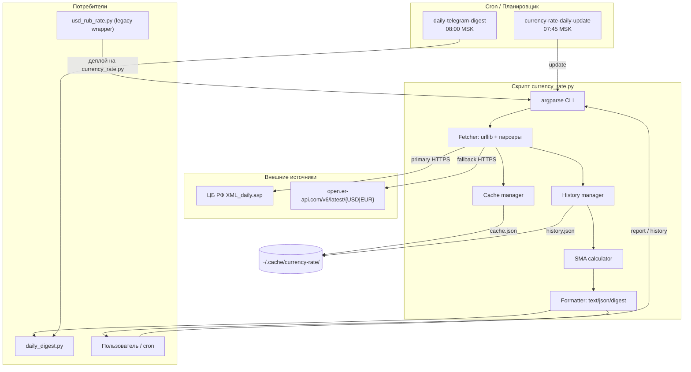
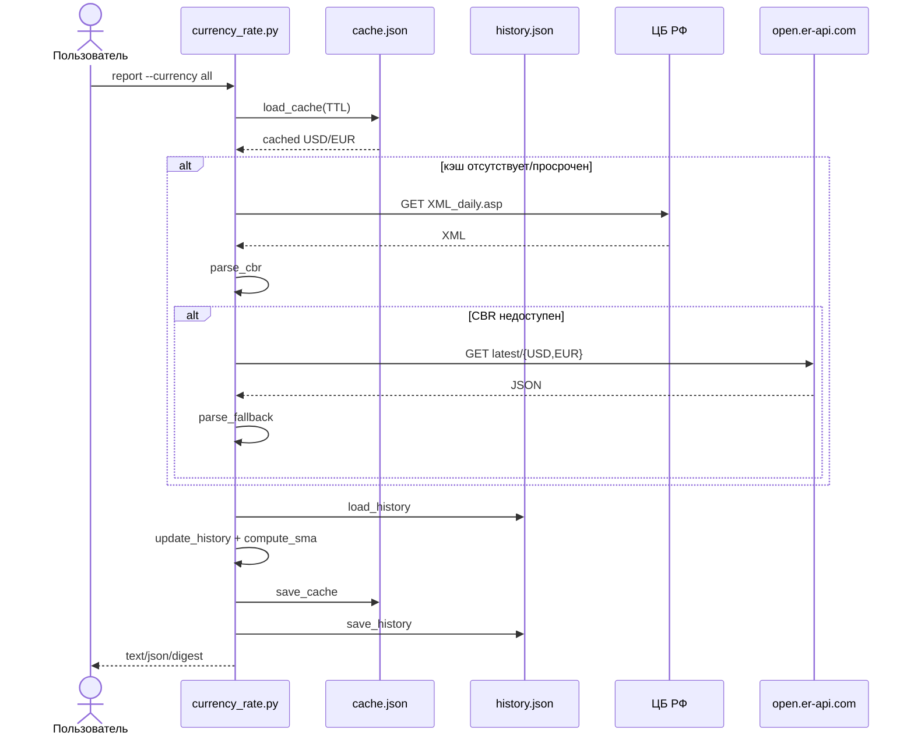

# Высокоуровневое проектное решение (HLD)

## 1. Контекст системы

Решение представляет собой консольную stdlib-only утилиту на Python 3.11+, которая:
- получает официальные курсы USD/RUB и EUR/RUB;
- сохраняет историю котировок за последние 90 дней;
- рассчитывает простую скользящую среднюю SMA30;
- обновляет данные в фоне по cron в 07:45 MSK (перед дайджестом);
- поставляет компактную строку для утреннего Telegram-дайджеста (08:00 MSK).

### Границы решения

**Входит (In scope):**
- USD/RUB и EUR/RUB (основной источник — XML ЦБ РФ, fallback — open.er-api.com).
- Локальное хранение истории до 90 дней и кэша в `~/.cache/currency-rate/`.
- Подкоманды `update`, `report`, `history`.
- Форматы вывода `text`, `json`, `digest`.
- Интеграция с `daily_digest.py` и двумя cron-заданиями.
- Stdlib-only Python 3.11.

**Не входит (Out of scope):**
- Другие валютные пары, графики, UI, базы данных, пороговые алерты, прогнозы.

### Заинтересованные стороны

| Роль | Интерес |
|------|---------|
| Пользователь скрипта | Быстро получать актуальные курсы USD/RUB и EUR/RUB с SMA30. |
| Администратор cron/дайджеста | Автоматическое обновление и стабильная вставка строки в Telegram. |
| Разработчик | Поддерживать единый скрипт `currency_rate.py` и legacy-обёртку. |
| Тестировщик | Проверить курсы, историю, SMA, fallback, cron, ошибки. |

---

## 2. Компонентная диаграмма



---

## 3. Карта модулей

| Модуль / файл | Назначение |
|---------------|-----------|
| `currency_rate.py` | Основной исполняемый скрипт v2.0.0: CLI, получение курсов, кэш, история, SMA, форматирование. |
| `usd_rub_rate.py` | Legacy-скрипт v1.0.0: сохраняет совместимость, делегирует запрос USD/RUB в `currency_rate.py`. |
| `daily_digest.py` | Сборка утреннего Telegram-дайджеста; вызывает `currency_rate.py report --format digest`. |
| `daily_digest_wrapper.sh` | Hermes-обёртка для cron `daily-telegram-digest`. |
| `currency_rate_update_wrapper.sh` *(новый)* | Hermes-обёртка для cron `currency-rate-daily-update` (`currency_rate.py update --timeout 15`), использует venv-интерпретатор. |
| `tests/test_currency_rate.py` | pytest-тесты для основной логики. |

### Внутренние компоненты `currency_rate.py`

| Компонент | Ответственность |
|-----------|-----------------|
| `fetch(url, timeout, accept)` | HTTPS-запрос через `urllib.request` с проверкой схемы и статуса. |
| `parse_cbr(data, char_code)` | Парсинг XML ЦБ РФ, извлечение курса и даты курса. |
| `parse_fallback(data, base)` | Парсинг JSON open.er-api.com, конвертация времени в MSK. |
| Cache manager (`load_cache` / `save_cache`) | Чтение/запись `cache.json` с TTL, атомарность через `open(..., 'w')`. |
| History manager (`load_history` / `save_history` / `update_history`) | Управление `history.json`: дедупликация по дате, обрезка по `history-days`, сортировка. |
| SMA calculator (`compute_sma`) | Среднее арифметическое за окно `moving-average-days`. |
| Formatter (`format_rate_line`, `format_digest_line`) | Формирование `text`, `json`, `digest`. |
| `run_update` / `run_report` / `run_history` | Подкоманды CLI. |
| `main` + `argparse` | Разбор аргументов и валидация. |

---

## 4. Интерфейсы

### 4.1 CLI `currency_rate.py`

```text
currency_rate.py [-h] [--currency {usd,eur,all}] [--source {auto,cbr,fallback}]
                 [--timeout SEC] [--no-fallback] [--no-cache] [--refresh]
                 [--use-stale] [--verbose] [--version] [--ttl SEC]
                 [--history-days N] [--moving-average-days N]
                 {update,report,history} ...

Подкоманды:
  update    — тихое обновление кэша и истории (stdout пуст при успехе).
  report    — вывод текущего курса и SMA30; форматы text/json/digest.
  history   — вывод истории заданной валюты в JSON.
```

### 4.2 Интерфейс `report --format digest`

Выход: многострочный UTF-8 блок без Markdown-спецсимволов.

```text
USD/RUB: 92.45 (SMA30: 91.80)
EUR/RUB: 101.23 (SMA30: 100.50)
```

При включении изменения за день (BR-10):

```text
USD/RUB: 92.45 (+0.12, SMA30: 91.80)
EUR/RUB: 101.23 (-0.05, SMA30: 100.50)
```

### 4.3 Интерфейс `report --format json`

```json
{
  "usd": {
    "rate": 92.45,
    "source": "cbr",
    "source_name": "ЦБ РФ",
    "timestamp": "2026-07-20T00:00:00+03:00",
    "sma30": 91.80
  },
  "eur": { ... }
}
```

### 4.4 Legacy-интерфейс `usd_rub_rate.py`

Обёртка вызывает:

```bash
python currency_rate.py --currency usd report --format text
```

Выход совместим с форматом v1.0.0:

```text
USD/RUB: 92.45 (источник: ЦБ РФ, дата: 2026-07-20)
```

### 4.5 Интерфейс cron-обёрток

| Cron | Обёртка | Команда |
|------|---------|---------|
| `daily-telegram-digest` | `daily_digest_wrapper.sh` | `daily_digest.py` |
| `currency-rate-daily-update` | `currency_rate_update_wrapper.sh` | `currency_rate.py update --timeout 15` |

---

## 5. Поток данных

### 5.1 Ручной просмотр курсов (`report`)



### 5.2 Тихое cron-обновление (`update`)

1. Cron `currency-rate-daily-update` в 07:45 MSK запускает обёртку.
2. Обёртка активирует venv и вызывает `.venv/bin/python currency_rate.py --timeout 15 update`.
3. Скрипт принудительно запрашивает курсы (`update` не использует кэш по умолчанию), сохраняет `cache.json` и дополняет `history.json`.
4. История хранит дату из источника (`ValCurs/@Date` для CBR); пропуски рабочих дней допустимы.
5. При успехе stdout пуст, stderr содержит диагностику только при `--verbose`.
6. При ошибке — exit code != 0; cron логирует выход, но не ломает другие задания.

### 5.3 Формирование дайджеста

1. Cron `daily-telegram-digest` в 08:00 MSK запускает `daily_digest.py`.
2. `daily_digest.py` вызывает `currency_rate.py --timeout 15 report --format digest`.
3. Скрипт возвращает многострочный блок; при ошибке `daily_digest.py` подставляет `❌ Курс недоступен`.

---

## 6. Схема хранения

### 6.1 Директория

```text
~/.cache/currency-rate/
├── cache.json
└── history.json
```

При `/` или недоступном `$HOME` используется локальная директория рядом со скриптом: `.currency-rate/`.

### 6.2 `cache.json`

Содержит последний успешный результат по каждой паре с меткой кэширования.

```json
{
  "usd": {
    "rate": 92.45,
    "source": "cbr",
    "source_name": "ЦБ РФ",
    "timestamp": "2026-07-20T00:00:00+03:00",
    "cached_at": "2026-07-20T12:00:05+03:00"
  },
  "eur": { ... }
}
```

### 6.3 `history.json`

```json
{
  "updated_at": "2026-07-20T12:00:05+03:00",
  "usd": [
    {
      "date": "2026-07-20",
      "rate": 92.45,
      "source": "cbr",
      "source_name": "ЦБ РФ",
      "timestamp": "2026-07-20T00:00:00+03:00"
    }
  ],
  "eur": [ ... ]
}
```

### 6.4 Правила хранения

- История обрезается до `--history-days` (по умолчанию 90) при каждом обновлении.
- Записи дедуплицируются по дате в рамках одной валюты (при обновлении удаляется старая запись за тот же день).
- Дата записи берётся из источника (`ValCurs/@Date` для CBR), а не фиксируется как сегодняшняя.
- Запись ведётся атомарно: запись во временный файл `{name}.tmp.{pid}` в той же директории, затем `os.replace(tmp, target)`.
- При повреждении JSON скрипт стартует с пустой историей/кэша.

---

## 7. Интеграция с cron

### 7.1 Существующие задания

| Имя | Расписание | Команда | Статус |
|-----|------------|---------|--------|
| `daily-telegram-digest` | `0 8 * * *` MSK | `daily_digest_wrapper.sh` | ✅ работает |

### 7.2 Требуемое новое задание

| Имя | Расписание | Команда | Назначение |
|-----|------------|---------|------------|
| `currency-rate-daily-update` | `45 7 * * *` MSK | `currency_rate_update_wrapper.sh` | Тихое обновление кэша и истории перед дайджестом |

### 7.3 Wrapper `currency_rate_update_wrapper.sh`

Размещается в `~/.hermes/scripts/` как часть конфигурации Hermes (не версионируется в `AI-harness`, но может быть скопирован туда при миграции).

```bash
#!/usr/bin/env bash
set -euo pipefail
PROJECT_DIR="${PROJECT_DIR:-/home/hermes_ai/my_agent/AI-harness}"
VENV="${PROJECT_DIR}/.venv/bin/python"
SCRIPT="${PROJECT_DIR}/scripts/currency_rate.py"
exec "$VENV" "$SCRIPT" --timeout 15 "$@" update
```

### 7.4 Поведение при сбоях

- Скрипт завершается с ненулевым кодом; cron-инфраструктура Hermes логирует факт сбоя.
- `daily_digest.py` не падает: при ошибке подставляет fallback-строку.
- Рекомендуется мониторинг: если 07:45-обновление не удалось, 08:00-дайджест получит stale-кэш или fallback-сообщение.

---

## 8. План развёртывания

### 8.1 Окружение

- Python 3.11+ (подтверждено 3.11.15).
- stdlib-only: пакеты `pip` не требуются.
- Рекомендуется venv `.venv` в `AI-harness/`, но скрипт работает и системным интерпретатором.

### 8.2 Шаги

1. Убедиться, что `currency_rate.py` v2.0.0 уже на месте и покрывает USD/RUB + EUR/RUB.
2. Создать обёртку `currency_rate_update_wrapper.sh` в `~/.hermes/scripts/`.
3. Добавить cron-задание:
   ```bash
   hermes cron add currency-rate-daily-update "45 7 * * *" ~/.hermes/scripts/currency_rate_update_wrapper.sh
   ```
4. Проверить:
   ```bash
   hermes cron list
   ```
5. Запустить ручной тест:
   ```bash
   python /home/hermes_ai/my_agent/AI-harness/scripts/currency_rate.py update --verbose
   python /home/hermes_ai/my_agent/AI-harness/scripts/currency_rate.py report --format digest
   ```
6. Обновить legacy `usd_rub_rate.py` на тонкую обёртку (если ещё не сделано) и проверить совместимость вывода.
7. Обновить/создать документацию: `brd_v2.md` (✅), `hld_v2.md` (данный документ), `spec_v2.md`.
8. Прогнать тесты: `pytest tests/test_currency_rate.py`.

---

## 9. Архитектурные решения

| ID | Решение | Обоснование | Альтернативы и почему отклонены |
|----|---------|-------------|---------------------------------|
| ADR-01 | Единый скрипт `currency_rate.py` вместо отдельных скриптов на пару | Меньше дублирования, проще тесты, единый формат вывода. | Отдельные `usd_rate.py`/`eur_rate.py` — дублирование парсеров и кэша. |
| ADR-02 | Локальные JSON-файлы вместо БД | Stdlib-only, нулевая стоимость инфраструктуры, проще backup/копирование. | SQLite — добавляет зависимость от файловой блокировки и сложнее миграции. |
| ADR-03 | ЦБ РФ как основной источник, open.er-api.com как fallback | Официальность + надёжность при сбое сети/сайта ЦБ. | Использование только fallback — потеря официальности; только ЦБ — риск недоступности. |
| ADR-04 | Подкоманда `update` не печатает в stdout | Cron-запуск не засоряет логи Hermes. | Печать в stdout — создаёт шум в cron-уведомлениях. |
| ADR-05 | `daily_digest.py` обращается к `currency_rate.py`, а не напрямую к API | Изоляция API, единая обработка ошибок и форматов. | Прямой запрос из дайджеста — дублирование логики. |
| ADR-06 | Legacy `usd_rub_rate.py` остаётся как обёртка | Обратная совместимость для существующих вызовов/alias. | Удаление — ломает старые cron/команды пользователя. |
| ADR-07 | SMA по доступным дням, если записей меньше окна | Избегаем NaN/ошибок на старте, когда история ещё не накоплена. | Строгий отказ при <30 дней — ухудшает UX первых запусков. |

---

## 10. Риски и митигация

| ID | Риск | Вероятность | Влияние | Митигация |
|----|------|-------------|---------|-----------|
| R-01 | Изменение/недоступность XML API ЦБ РФ | Низкая | Среднее | Fallback open.er-api.com, unit-тесты парсеров, версионирование. |
| R-02 | Ограничение частоты fallback-API | Низкая | Низкое | Тихое cron-обновление 1 раз в сутки, кэш TTL 5 мин. |
| R-03 | Отсутствие интернета | Высокая в отдельных сценариях | Низкое | Понятное сообщение об ошибке, опциональный stale-кэш (`--use-stale`). |
| R-04 | Повреждение `history.json` | Низкая | Среднее | Восстановление с пустой историей при `JSONDecodeError`; в будущем — атомарная запись. |
| R-05 | Расхождение времени обновления и публикации ЦБ РФ (курс ~11:30 MSK) | Средняя | Низкое | Использование операционной даты из ответа API; отображение даты актуальности. |
| R-06 | Одновременная запись кэша/истории из cron и ручного запуска | Низкая | Низкое | Каждая операция — перезапись всего файла; при пересечении побеждает последняя запись. |

---

## 11. Открытые вопросы

| ID | Вопрос | Владелец | Влияние | Статус |
|----|--------|----------|---------|--------|
| OQ-01 | Нужно ли в `digest` показывать изменение курса за предыдущий день (BR-10)? | Заказчик/BA | UX дайджеста | Требуется подтверждение; в скрипте история уже есть, изменение легко добавить. |
| OQ-02 | Стоит ли сделать запись `history.json` атомарной (`tmp` + `rename`) и/или добавить резервную копию? | Разработчик | Надёжность | Текущая реализация неатомарна; решить до релиза. |
| OQ-03 | Какое поведение при отсутствии интернета в 12:00-cron: оставить exit != 0 или использовать stale-кэш? | BA/Админ cron | Надёжность | Рекомендуется exit != 0 для прозрачного мониторинга. |
| OQ-04 | Нужен ли отдельный `spec_v2.md` с детальным описанием парсеров/форматов? | Архитектор | Документация | Да, рекомендуется как следующий артефакт. |

---

## 12. Матрица трассировки требований

| BR | HLD-решение | Компонент |
|----|-------------|-----------|
| BR-01 USD/RUB + EUR/RUB | `CURRENCIES` + `fetch_all` | `currency_rate.py` |
| BR-02 90-дневная история | `history.json` + `update_history` | History manager |
| BR-03 SMA30 | `compute_sma` + `--moving-average-days` | SMA calculator |
| BR-04 Тихое cron-обновление | `update` + `currency-rate-daily-update` | Cron + wrapper |
| BR-05 Интеграция с дайджестом | `report --format digest` | `currency_rate.py`, `daily_digest.py` |
| BR-06 text/json/digest | Formatter | `currency_rate.py` |
| BR-07 Stdlib-only | `urllib`, `xml.etree`, `json`, `argparse` | Весь проект |
| BR-08 Обработка ошибок | fallback + `--use-stale` + чёткие сообщения | `currency_rate.py` |
| BR-09 Legacy wrapper | `usd_rub_rate.py` делегирует `currency_rate.py` | Legacy script |
| BR-10 Изменение за день | история + дополнительный сегмент в `format_digest_line` | Formatter |

---

## 13. Приложение: примеры вызовов

```bash
# Тихое обновление (cron)
python currency_rate.py update --timeout 15

# Отчёт для человека
python currency_rate.py report --currency all --format text

# Компактная строка для Telegram
python currency_rate.py report --format digest

# История за 90 дней
python currency_rate.py history --currency all --history-days 90

# Legacy-совместимость
python usd_rub_rate.py
```
