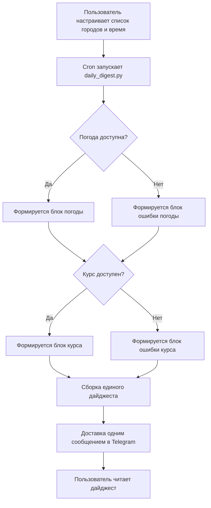

# Бизнес-требования (BRD): daily-telegram-digest

## 1. Цель доработки (Goal)

Создать единый ежедневный cron-дайджест, который объединяет прогноз погоды для заданных городов и актуальный курс USD/RUB, и отправляет результат одним Telegram-сообщением.

---

## 2. Текущая ситуация (AS-IS)

| Аспект | Описание |
|--------|----------|
| Скрипт погоды | `weather_daily.py` в `~/.hermes/scripts/weather_daily.py`. Запускается cron `984d5d5e9628` в 08:00 МСК. Отправляет погоду отдельным сообщением. |
| Скрипт курса | `usd_rub_rate.py` в `/home/hermes_ai/my_agent/AI-harness/scripts/usd_rub_rate.py`. Нет cron-задания. |
| Расписание | Два изолированных процесса (погода — отдельно, курс — вручную/не настроен). |
| Доставка | `hermes cron` с `deliver: origin` и режимом `no-agent` (stdout → Telegram). |
| Среда | Python 3.11.15, сервер Europe/Moscow (MSK, UTC+3). |

---

## 3. Желаемое состояние (TO-BE)

- Один управляющий скрипт `daily_digest.py` внутри проекта `daily-telegram-digest`.
- Скрипт последовательно вызывает логику погоды и логику курса или импортирует их как модули.
- Результат формируется в виде единого Markdown/текстового сообщения с заголовком, блоком погоды, блоком курса и подписью.
- Cron-задание запускает `daily_digest.py` один раз в день и доставляет stdout в Telegram.
- Старое задание погоды (`984d5d5e9628`) отключается/удаляется после приёмки.

---

## 4. Бизнес-ценность

- **Единое окно**: пользователь получает утренний дайджест одним сообщением.
- **Снижение шума**: меньше отдельных сообщений от бота.
- **Расширяемость**: шаблон позволяет легко добавлять новые блоки (крипта, новости, задачи).
- **Надёжность**: централизованная обработка ошибок и один канал диагностики.

---

## 5. Границы (Scope)

**Входит в скоуп:**
- Создание управляющего скрипта `daily_digest.py`.
- Интеграция существующих `weather_daily.py` и `usd_rub_rate.py`.
- Формирование единого сообщения.
- Настройка нового cron-задания `hermes cron`.
- Отключение/удаление старого cron-задания погоды.
- Логирование ошибок в stderr.

**Не входит в скоуп:**
- Изменение источников данных (Open-Meteo, ЦБ РФ / open.er-api.com).
- Изменение форматирования внутри блоков погоды или курса, за исключением обрамляющего заголовка/подвала дайджеста.
- GUI, веб-интерфейс, база данных.
- Поддержка других мессенджеров.

---

## 6. Допущения и ограничения

- Telegram Bot Token и `TELEGRAM_HOME_CHANNEL` уже настроены в `~/.hermes/.env` (комментарии в файле, требуется активация).
- Скрипты работают в окружении Hermes с Python 3.11.
- Источники API доступны и не требуют авторизации.
- Погода поддерживает до 10 городов; по умолчанию — Москва.
- Курс USD/RUB берётся из ЦБ РФ с fallback на open.er-api.com.

---

## 7. Глоссарий

| Термин | Описание |
|--------|----------|
| Дайджест | Одно сообщение Telegram, содержащее погоду и курс. |
| Cron-задание | Запланированная задача в `hermes cron`, доставляющая stdout скрипта в Telegram. |
| no-agent режим | Режим `hermes cron`, при котором stdout скрипта отправляется без участия LLM. |
| `origin` | Доставка по умолчанию в настроенный `TELEGRAM_HOME_CHANNEL`. |

---

## 8. User Story

**Как** пользователь Telegram-бота Hermes,  
**Я хочу** каждое утро получать одно сообщение с погодой для моих городов и актуальным курсом USD/RUB,  
**Чтобы** видеть ключовую утреннюю информацию без лишних уведомлений.

### Acceptance Criteria

- [AC-1] Сообщение приходит не более одного раза в день.
- [AC-2] В сообщении есть блок погоды и блок курса USD/RUB.
- [AC-3] Если один из источников недоступен, дайджест всё равно отправляется с пояснением об ошибке.
- [AC-4] Старое отдельное сообщение о погоде перестаёт приходить.

---

## 9. Клиентский путь (CJM)

---

## 10. Бизнес-требования (BR-NN)

### BR-01. Управляющий скрипт
**Описание:** Создать скрипт `daily_digest.py` в проекте `daily-telegram-digest`.  
**Критерий приёмки:** Файл расположен в `/home/hermes_ai/my_agent/AI-harness/projects/daily-telegram-digest/daily_digest.py` и имеет право на выполнение.  
**Приоритет:** Must have.

### BR-02. Интеграция погоды
**Описание:** `daily_digest.py` должен получать данные погоды с помощью существующего `weather_daily.py`.  
**Критерий приёмки:** При запуске без аргументов блок погоды содержит прогноз для Москвы; при наличии `WEATHER_CITIES` или аргументов — для указанных городов.  
**Приоритет:** Must have.

### BR-03. Интеграция курса USD/RUB
**Описание:** `daily_digest.py` должен получать курс USD/RUB с помощью `usd_rub_rate.py`.  
**Критерий приёмки:** Блок курса содержит строку `USD/RUB: <rate> (источник: ...)` и дату.  
**Приоритет:** Must have.

### BR-04. Единое сообщение
**Описание:** Вывод обоих блоков формируется одним вызовом `print()` или эквивалентом, разделённым заголовком и подвалом.  
**Критерий приёмки:** Cron получает один stdout, который Telegram отправляет как одно сообщение.  
**Приоритет:** Must have.

### BR-05. Обработка частичных ошибок
**Описание:** Если один из блоков не удалось построить, дайджест отправляется с текстом ошибки вместо этого блока.  
**Критерий приёмки:** При недоступности Open-Meteo в сообщении присутствует пояснение "❌ Погода недоступна"; курс отображается.  
**Приоритет:** Must have.

### BR-06. Замена старого cron-задания
**Описание:** После приёмки новое задание активно, старое задание погоды (`984d5d5e9628`) отключено или удалено.  
**Критерий приёмки:** `hermes cron list` показывает только одно ежедневное дайджест-задание, связанное с погодой/курсом.  
**Приоритет:** Must have.

### BR-07. Настраиваемое время отправки
**Описание:** Время отправки задаётся в cron-выражении в часовом поясе сервера.  
**Критерий приёмки:** Задание запускается в желаемое wall-clock время (по умолчанию 08:00 МСК).  
**Приоритет:** Should have.

### BR-08. Поддержка списка городов
**Описание:** Решение сохраняет существующие приоритеты источников городов: CLI-аргументы > `WEATHER_CITIES` > `~/.config/weather_daily/cities.json` > Москва.  
**Критерий приёмки:** Изменение `cities.json` или переменной `WEATHER_CITIES` влияет на дайджест без правки кода.  
**Приоритет:** Should have.

---

## 11. Бизнес-правила (BRULE-NN)

### BRULE-01. Источники данных
- Погода: Open-Meteo Geocoding + Forecast API, бесплатный, без ключа.
- Курс: ЦБ РФ (`cbr.ru`) — приоритетный; fallback — `open.er-api.com`.

### BRULE-02. Порядок блоков в сообщении
1. Заголовок дайджеста с датой.
2. Блок погоды.
3. Блок курса USD/RUB.
4. Подвал с источниками.

### BRULE-03. Политика повторов
- При сбое источника не более 2 попыток (`MAX_RETRIES` из `weather_daily.py`).
- Fallback на второй источник курса включается по умолчанию.

### BRULE-04. Время по умолчанию
- Cron-расписание: `0 8 * * *` (08:00 МСК) — соответствует старому заданию погоды.

### BRULE-05. Telegram-формат
### BRULE-05 — Telegram-формат

Сообщение отправляется как **plain text**. Скрипт `daily_digest.py` должен удалять Markdown-спецсимволы (`*`, `_`, `[`, `]`, `(`, `)`, `~`, `` ` ``, `>`, `#`, `+`, `=`, `{`, `}`, `!`) из вывода вложенных скриптов, чтобы избежать ошибок парсинга Telegram и неожиданного форматирования. Заголовок и подвал используют только безопасные символы.

### BRULE-06 — Место размещения управляющего скрипта

Для запуска через `hermes cron` управляющий скрипт `daily_digest.py` должен быть доступен по относительному имени в каталоге скриптов Hermes (`~/.hermes/scripts/`). Для разработки и версионирования мастер-копия хранится в репозитории `AI-harness/scripts/`, а в `~/.hermes/scripts/` размещается символическая ссылка или копия.

## 13. Нефункциональные требования (NFR-NN)

### NFR-01. Доступность (Availability)
- Дайджест должен отправляться ежедневно с вероятностью ≥ 95% при доступности сети.
- При недоступности API сообщение всё равно доставляется с пояснением ошибки.

### NFR-02. Надёжность (Reliability)
- Изолированные сбои погоды и курса не прерывают отправку всего сообщения.
- Код возврата скрипта: `0` — успех при любой отправке; `1` — критический сбой; `2` — ошибка CLI/конфигурации.

### NFR-03. Производительность (Performance)
- Время выполнения скрипта ≤ 30 секунд при нормальной сети.
- Таймаут HTTP-запросов не более 10 секунд.

### NFR-04. Безопасность (Security)
- Telegram Bot Token читается только из `~/.hermes/.env`; не сохраняется в репозитории.
- Скрипт не выполняет произвольный shell-код на основе пользовательского ввода.
- Markdown-спецсимволы из вывода вложенных скриптов **удаляются**, чтобы сообщение доставлялось как plain text.
- `daily_digest.py` не читает Telegram-токен и не сохраняет входные/выходные данные.
- Все ошибки пишутся в `stderr`.
- В `stdout` попадает только финальное сообщение для Telegram.

### NFR-06. Портативность (Portability)
- Скрипт совместим с Python 3.11.
- Используется стандартная библиотека + переиспользование существующих скриптов.
- Запуск через `hermes cron` в окружении пользователя `hermes_ai`.
- Проектный venv рекомендуется для локальной разработки и стабильного production.

### NFR-07. Конфигурируемость
- Время, список городов и канал доставки настраиваются без изменения кода `daily_digest.py`.

---

## 13. Нормативные требования (REG-NN)

> Не применимы: решение не обрабатывает персональные данные третьих лиц и не подпадает под специальные регуляторные требования.  
> Пользовательские Telegram-идентификаторы обрабатываются в рамках настроенного Telegram-бота.

---

## 14. Риски (R-NN)

### R-01. Telegram Token не активирован
**Описание:** В `~/.hermes/.env` `TELEGRAM_BOT_TOKEN` закомментирован.  
**Митигация:** Уточнить у пользователя и активировать перед деплоем.

### R-02. Конфликт со старым cron-заданием
**Описание:** Старое задание погоды (`984d5d5e9628`) продолжит отправлять дубль, пока не отключено.  
**Митигация:** Включить отключение/удаление в план приёмки (BR-06).

### R-03. Разные пути и зависимости у скриптов
**Описание:** `weather_daily.py` и `usd_rub_rate.py` лежат в разных каталогах и могут иметь разные логи/кэши.  
**Митигация:** Использовать `sys.path` или внешний wrapper; не дублировать код.

### R-04. Ограничение длины Telegram-сообщения
**Описание:** При большом списке городов сообщение может превысить 4096 символов.  
**Митигация:** Проверять длину и урезать/разбивать при превышении.

### R-05. Несоответствие часового пояса
**Описание:** Cron интерпретирует время в системном часовом поясе (MSK). Ошибка конверсии приведёт к сдвигу на 3 часа.  
**Митигация:** Использовать `0 8 * * *` для 08:00 МСК; проверять `timedatectl`.

### R-06. Зависимость от внешних API
**Описание:** Open-Meteo и ЦБ РФ могут быть недоступны.  
**Митигация:** Частичные ошибки не отменяют отправку (BR-05, NFR-02).

---

## 15. Заинтересованные стороны и зависимости

| Роль | Интерес |
|------|---------|
| Пользователь Telegram | Получать ежедневный дайджест. |
| Разработчик / System Analyst | Спроектировать `daily_digest.py`, cron, обработку ошибок. |
| DevOps / Hermes maintainer | Убедиться, что токен и канал настроены, старое задание отключено. |

**Зависимости:**
- `~/.hermes/.env` с `TELEGRAM_BOT_TOKEN` и `TELEGRAM_HOME_CHANNEL`.
- `weather_daily.py` в `~/.hermes/scripts/`.
- `usd_rub_rate.py` в `/home/hermes_ai/my_agent/AI-harness/scripts/`.
- Hermes CLI (`hermes cron`) и cron-демон.
- Python 3.11, сеть HTTPS.

---

## 16. Предпосылки для системных требований

- **SR-PR-01.** Python 3.11 должен быть доступен в PATH при запуске через `hermes cron`.
- **SR-PR-02.** Необходим project-venv или использование system Python; если скрипт требует дополнительных зависимостей — оформить `requirements.txt`.
- **SR-PR-03.** Скрипты `weather_daily.py` и `usd_rub_rate.py` должны быть вызываемы как Python-модули или через subprocess.
- **SR-PR-04.** `daily_digest.py` должен корректно работать при отсутствии переменных окружения, за исключением `TELEGRAM_HOME_CHANNEL`, который используется Hermes, а не самим скриптом.
- **SR-PR-05.** Необходимо cron-задание с `no-agent` и `script: daily_digest.py`.

---

## 17. Среда разработки и развёртывания

| Параметр | Значение |
|----------|----------|
| Хост | Linux 5.15.0, пользователь `hermes_ai`, home `/home/hermes_ai` |
| Python | 3.11.15 |
| Часовой пояс сервера | Europe/Moscow (MSK, UTC+3) |
| Изоляция | Рекомендуется project-venv; текущие скрипты используют только stdlib |
| Менеджер зависимостей | `requirements.txt` или `pyproject.toml`, если появятся внешние пакеты |
| Планировщик | `hermes cron` (cron-задания хранятся в `~/.hermes/cron/jobs.json`) |
| Доставка | `deliver: origin` → `TELEGRAM_HOME_CHANNEL` |
| Рабочая директория проекта | `/home/hermes_ai/my_agent/AI-harness/projects/daily-telegram-digest` |

---

## 18. Definition of Ready (DoR)

| # | Критерий | Статус |
|---|----------|--------|
| D1 | Бизнес-заказчик / пользователь идентифицирован | ✅ |
| D2 | AS-IS и TO-BE описаны | ✅ |
| D3 | Цель заявлена | ✅ |
| D4 | User story с критериями приёмки | ✅ |
| D5 | CJM / BPMN присутствует | ✅ |
| D6 | Заинтересованные стороны перечислены | ✅ |
| D7 | Системы / сервисы идентифицированы | ✅ |
| D12 | NFR по потреблению / масштабируемости заявлены | ✅ |
| D13 | NFR по производительности / нагрузке заявлены | ✅ |
| D14 | Хотя бы одно BR присутствует | ✅ |

**DoR: 10/10 → ГОТОВ**

---

## 19. Definition of Done (DoD)

| # | Критерий | Статус |
|---|----------|--------|
| DD1 | Все разделы BRD заполнены | ✅ |
| DD2 | Каждое BR имеет критерий приёмки | ✅ |
| DD3 | Каждое бизнес-правило имеет источник / обоснование | ✅ |
| DD4 | REG не применимы / обоснованы | ✅ |
| DD5 | Нет блокирующих открытых вопросов | ⚠️ (см. Open Questions) |
| DD6 | Заинтересованные стороны заполнены | ✅ |
| DD7 | Предпосылки для SR заполнены | ✅ |
| DD8 | Human gate: требуется ревью бизнес-заказчика | ⏳ |
| DD9 | MD-файл сохранён в проекте | ✅ |

**DoD: 9/10 → УСЛОВНО ГОТОВ** (ожидает ревью и ответов на открытые вопросы)

---

## 20. Открытые вопросы (Open Questions)

| # | Вопрос | Владелец | Влияние | Статус / Решение |
|---|--------|----------|---------|------------------|
| OQ-01 | Активен ли `TELEGRAM_BOT_TOKEN` в `~/.hermes/.env`? | Пользователь / DevOps | Без токена доставка невозможна. | Требуется проверка перед деплоем. |
| OQ-02 | В какое время отправлять дайджест (по умолчанию 08:00 МСК)? | Пользователь | Влияет на cron-расписание. | ✅ **Решено: 08:00 МСК** (Human Gate). |
| OQ-03 | Какой список городов использовать по умолчанию (текущий — Москва)? | Пользователь | Влияет на конфиг `cities.json` / `WEATHER_CITIES`. | ✅ **Решено: Москва** (Human Gate). |
| OQ-04 | Нужна ли поддержка Markdown-разметки в сообщении? | Пользователь | Влияет на экранирование в `daily_digest.py`. | ✅ **Решено: plain text по умолчанию**, `weather_daily.py` asterisks strip. |
| OQ-05 | Импортировать модули или запускать скрипты через subprocess? | System Analyst / Разработчик | Влияет на структуру wrapper. | ✅ **Решено: subprocess** (Human Gate). |

---

## 21. Список идентификаторов требований

- **BR-01** — управляющий скрипт
- **BR-02** — интеграция погоды
- **BR-03** — интеграция курса USD/RUB
- **BR-04** — единое сообщение
- **BR-05** — обработка частичных ошибок
- **BR-06** — замена старого cron-задания
- **BR-07** — настраиваемое время отправки
- **BR-08** — поддержка списка городов
- **BRULE-01** — источники данных
- **BRULE-02** — порядок блоков
- **BRULE-03** — политика повторов
- **BRULE-04** — время по умолчанию
- **BRULE-05** — Telegram-формат
- **NFR-01** — доступность
- **NFR-02** — надёжность
- **NFR-03** — производительность
- **NFR-04** — безопасность
- **NFR-05** — наблюдаемость
- **NFR-06** — портативность
- **NFR-07** — конфигурируемость
- **R-01 … R-06** — риски
