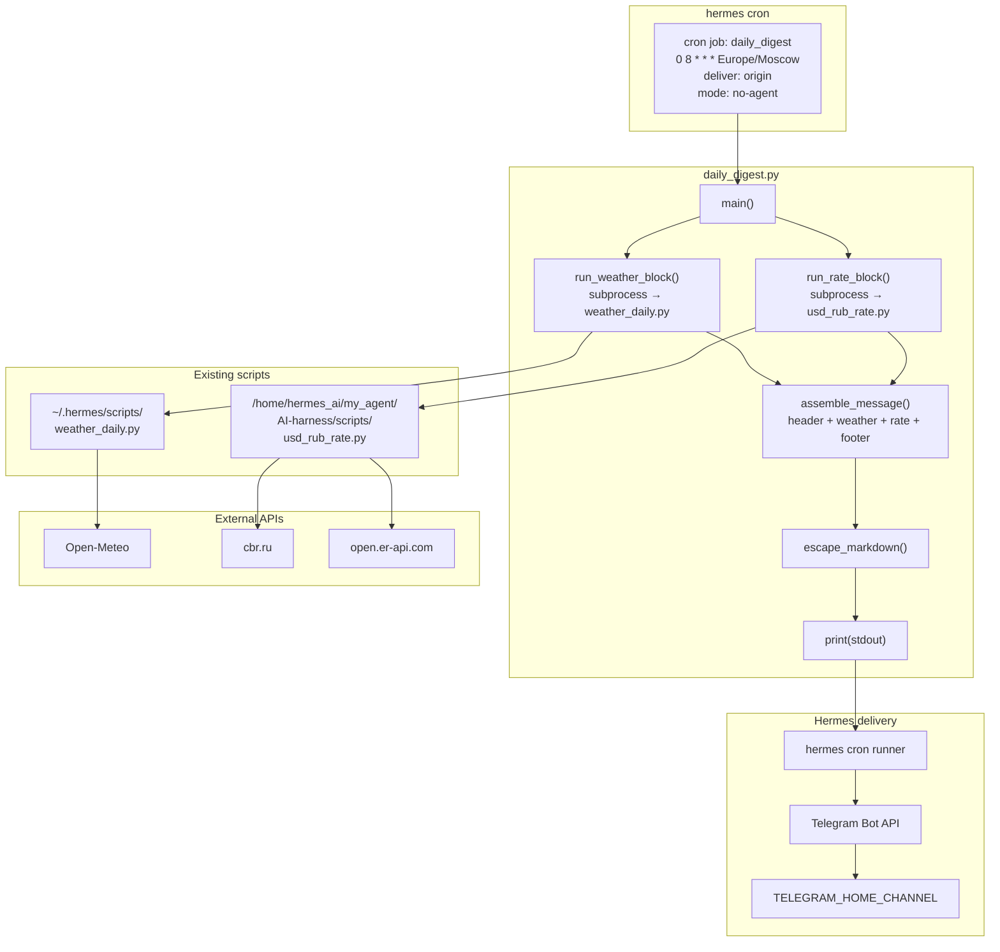

# High-Level Design (HLD): daily-telegram-digest

## 1. Цель документа

Определить архитектуру ежедневного Telegram-дайджеста, объединяющего погоду и курс USD/RUB, на основе BRD и решений, принятых на Human Gate.

---

## 2. Human Gate Decisions

| Вопрос | Решение |
|--------|---------|
| Время отправки | 08:00 MSK, заменяет старый weather cron |
| Город по умолчанию | Москва |
| Markdown | Минимальный: **жирный** заголовок, список; безопасное экранирование |
| Интеграция скриптов | `subprocess`: `weather_daily.py` и `usd_rub_rate.py` запускаются отдельно |
| Telegram token | Использовать существующий `TELEGRAM_BOT_TOKEN` из `~/.hermes/.env` |

---

## 3. Архитектурная схема



---

## 4. Компоненты

### 4.1 Управляющий скрипт: `daily_digest.py`

| Параметр | Значение |
|----------|----------|
| Путь | `/home/hermes_ai/my_agent/AI-harness/projects/daily-telegram-digest/daily_digest.py` |
| Язык | Python 3.11 |
| Зависимости | stdlib only |
| Вход | env `WEATHER_CITIES`, аргументы CLI, конфиг `~/.config/weather_daily/cities.json` |
| Выход | stdout — единое сообщение для Telegram; stderr — логи/ошибки |

### 4.2 Блоки

| Блок | Функция | Источник |
|------|---------|----------|
| Header | Дата и заголовок дайджеста | `daily_digest.py` |
| Weather | Прогноз погоды для городов | `weather_daily.py` via subprocess |
| Rate | Курс USD/RUB | `usd_rub_rate.py` via subprocess |
| Footer | Источники и подпись | `daily_digest.py` |

---

## 5. Интеграция с существующими скриптами

### 5.1 Способ интеграции: subprocess

Выбран `subprocess.run([sys.executable, SCRIPT, ...])`, потому что:

- Скрипты находятся в разных директориях.
- Оба скрипта не предоставляют стабильного публичного API как модули.
- `weather_daily.py` уже форматирует и печатает свой блок в stdout.
- Изоляция: ошибка одного не ломает выполнение другого.

### 5.2 Вызов погоды

```python
import subprocess
import sys
from pathlib import Path

WEATHER_SCRIPT = Path.home() / ".hermes" / "scripts" / "weather_daily.py"

result = subprocess.run(
    [sys.executable, str(WEATHER_SCRIPT)] + cities,
    capture_output=True,
    text=True,
    timeout=30,
)
weather_text = result.stdout if result.returncode == 0 else "❌ Погода недоступна"
```

Передача городов:
- Если `WEATHER_CITIES` или `cities.json` уже заданы — не передаём аргументы.
- Иначе передаём `Москва` или значение из конфига.

### 5.3 Вызов курса

```python
RATE_SCRIPT = Path(
    "/home/hermes_ai/my_agent/AI-harness/scripts/usd_rub_rate.py"
)

result = subprocess.run(
    [sys.executable, str(RATE_SCRIPT), "--source", "auto"],
    capture_output=True,
    text=True,
    timeout=15,
)
rate_text = result.stdout.strip() if result.returncode == 0 else "❌ Курс недоступен"
```

---

## 6. Формат сообщения

### 6.1 Структура

```
**☀️ Утренний дайджест — 19.07.2026**

🌍 *Москва* — прогноз на сегодня
📍 *Сейчас:* +22° (Преимущественно ясно) 🌤
🌡 Ощущается: +21°
💧 Влажность: 45%
💨 Ветер: 3 м/с
...

💰 **Курс:** USD/RUB: 87.45 (источник: ЦБ РФ, дата: 2026-07-19)

─────────────────
🤖 Hermes daily digest  |  📅 19.07.2026
```

### 6.2 Требования к формату

- Сообщение отправляется как **plain text** (`parse_mode` по умолчанию в Hermes cron).
- Эмодзи допустимы.
- Markdown-спецсимволы (`*`, `_`, `[`, `]`, `(`, `)`, `~`, `` ` ``, `>`, `#`, `+`, `=`, `{`, `}`, `!`), если они встречаются в данных погоды или курса, **удаляются** перед сборкой сообщения, чтобы избежать ошибок парсинга и неожиданного форматирования.
- Telegram limit: ≤ 4096 символов. При превышении:
  1. Сначала удалить строку с источниками/подвалом.
  2. Затем сократить погодный блок по границам городов (не обрезая строку посередине).
  3. В конце добавить `…`.
  4. Все операции выполняются по кодовым точкам Unicode, не ломая UTF-8.

---

## 7. Telegram доставка

### 7.1 Механизм

- `hermes cron` запускает `daily_digest.py`.
- `deliver: origin` → отправляет stdout в Telegram home channel.
- Режим `no-agent`: без LLM-обработки, как есть.
- Скрипт должен выводить в `stdout` только готовое сообщение, в `stderr` — диагностику.

### 7.2 Размещение скрипта

Мастер-копия: `/home/hermes_ai/my_agent/AI-harness/scripts/daily_digest.py`.
Для `hermes cron` скрипт должен быть доступен по имени в `~/.hermes/scripts/`:

```bash
ln -s /home/hermes_ai/my_agent/AI-harness/scripts/daily_digest.py ~/.hermes/scripts/daily_digest.py
chmod +x ~/.hermes/scripts/daily_digest.py
```

### 7.3 Настройка cron

Команда для создания после приёмки:

```bash
hermes cron add \
  --name "daily-telegram-digest" \
  --schedule "0 8 * * *" \
  --timezone "Europe/Moscow" \
  --script "daily_digest.py" \
  --deliver origin \
  --mode no-agent
```

### 7.4 Отключение старого задания

Старое задание погоды `984d5d5e9628` существует и активно. Перед активацией нового дайджеста:

```bash
hermes cron disable 984d5d5e9628
# или
hermes cron remove 984d5d5e9628
```

Если id отличается в другой среде, отключить/удалить все задания со словом "Погода" в имени.

### 7.5 Rollback и dry-run

- **Dry-run:** запустить вручную и проверить stdout:
  ```bash
  ~/.hermes/scripts/daily_digest.py
  ```
- **Acceptance sign-off:** пользователь получает тестовое сообщение и подтверждает формат.
- **Rollback:** если новый дайджест не работает:
  ```bash
  hermes cron remove <new-job-id>
  hermes cron enable 984d5d5e9628
  ```
- **Backup конфигурации:** перед изменением сохранить `~/.hermes/cron/jobs.json`.

---

## 8. Окружение и деплоймент

### 8.1 Файлы проекта

```
/home/hermes_ai/my_agent/AI-harness/projects/daily-telegram-digest/
├── brd.md
├── hld.md
├── daily_digest.py
└── requirements.txt   # если понадобятся внешние пакеты (сейчас: stdlib)
```

### 8.2 Переменные окружения

| Переменная | Где используется | Комментарий |
|------------|------------------|-------------|
| `TELEGRAM_BOT_TOKEN` | Hermes delivery | Из `~/.hermes/.env` |
| `TELEGRAM_HOME_CHANNEL` | Hermes delivery | Из `~/.hermes/.env` |
| `WEATHER_CITIES` | `weather_daily.py` | Опционально |
| `PATH` | cron | Должен содержать `python3` |

### 8.3 Права

```bash
chmod +x daily_digest.py
```

---

## 9. Обработка ошибок

### 9.1 Уровни ошибок

| Сценарий | Поведение | Exit code |
|----------|-----------|-----------|
| Погода недоступна | Вставить `❌ Погода недоступна`, продолжить | 0 |
| Курс недоступен | Вставить `❌ Курс недоступен`, продолжить | 0 |
| Оба источника недоступны | Отправить сообщение с двумя ошибками | 0 |
| Критическая ошибка (нет stdout) | Лог в stderr | 1 |
| Timeout subprocess > 30 сек | Убить процесс, вернуть ошибку | 0 |

### 9.2 Логирование

- Все ошибки пишутся в `stderr` через `logging`.
- `stdout` содержит только финальное сообщение.

### 9.3 Экранирование Markdown

```python
def escape_markdown(text: str) -> str:
    chars = r"*_[]()~`>#+-=|{}.!"
    return "".join(f"\\{ch}" if ch in chars else ch for ch in text)
```

Применяется только к неподконтрольным строкам (названия городов из API, данные погоды).

---

## 10. Нефункциональные требования и ограничения

| ID | Требование | Решение |
|----|------------|---------|
| NFR-02 | Надёжность | subprocess isolation, fallback rate, частичные ошибки |
| NFR-03 | Производительность | timeout 30s, HTTP timeout внутри скриптов 10s |
| NFR-04 | Безопасность | token не читается скриптом, только Hermes; нет eval/shell |
| NFR-05 | Наблюдаемость | stderr-логи, stdout только сообщение |
| NFR-07 | Конфигурируемость | время в cron, города в env/config, channel в `.env` |

---

## 11. Риски и митигация

| ID | Риск | Митигация |
|----|------|-----------|
| R-01 | Token не активен | Проверить `~/.hermes/.env` перед деплоем |
| R-02 | Старый cron дублирует | Отключить/удалить `984d5d5e9628` после приёмки |
| R-04 | Сообщение > 4096 символов | Проверка длины и обрезка с `…` |
| R-05 | Часовой пояс | `timezone: Europe/Moscow`, проверить `timedatectl` |

---

## 12. Интерфейсы и контракты

### 12.1 `daily_digest.py` CLI

```bash
python3 daily_digest.py [CITY ...]
```

- Позиционные аргументы переопределяют город по умолчанию.
- Без аргументов используется `WEATHER_CITIES` → `cities.json` → Москва.

### 12.2 Контракт `weather_daily.py`

- Вход: список городов через CLI.
- Выход: форматированный текст погоды в stdout.
- Код возврата: 0 — успех, 1 — частичные ошибки, 2 — конфигурационная ошибка.

### 12.3 Контракт `usd_rub_rate.py`

- Вход: `--source auto` (по умолчанию).
- Выход: строка `USD/RUB: <rate> (источник: ..., дата: ...)`.
- Код возврата: 0 — успех, 1 — ошибка.

---

## 13. Acceptance Criteria Mapping

| BRD AC | HLD решение |
|--------|-------------|
| AC-1 | Одно cron-задание на 08:00 MSK |
| AC-2 | `run_weather_block()` + `run_rate_block()` внутри `assemble_message()` |
| AC-3 | Частичные ошибки — placeholder вместо блока, отправка продолжается |
| AC-4 | Отключение старого задания `984d5d5e9628` |

---

## 14. Definition of Done для HLD

- [x] Компоненты определены.
- [x] Интеграция с `weather_daily.py` и `usd_rub_rate.py` описана.
- [x] Telegram delivery и cron setup описаны.
- [x] Environment/deployment описан.
- [x] Error handling и message format описаны.
- [x] Human Gate decisions учтены.

**HLD статус: ГОТОВ к реализации.**
