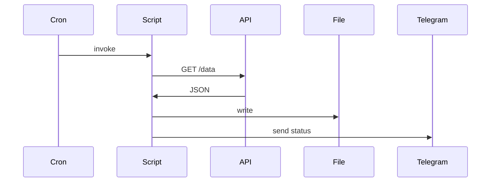

<!-- Template: skills/docgen/templates/spec-template.md | Generated: 2026-07-20 -->

# Technical Specification: Sample API Integration

## 1. Constraints

- Python 3.11+
- Local cron deployment via Hermes
- No external secrets storage beyond keytar/system_config

## 2. Glossary

| Term | Definition |
|------|------------|
| API | External REST endpoint |
| Cron | Hermes scheduled task |
| MoM | Minutes of Meeting |

## 3. Business Rules

| ID | Rule | Formula / Condition | Priority |
|----|------|---------------------|----------|
| BRULE-01 | Do not log secrets | Tokens/passwords must be redacted in logs | High |
| BRULE-02 | Fail gracefully | On API error, script exits non-zero and logs reason | High |

## 4. Use Cases

### UC-01: Daily data fetch

Actor: Cron scheduler  
Precondition: API token configured  
Postcondition: Data saved, notification sent  
Flow: scheduler invokes script → script fetches data → parses → saves → reports success

## 5. Functional Requirements

| ID | Description | Acceptance Criteria | Priority | Related SR |
|----|-------------|---------------------|----------|------------|
| FR-01 | Script accepts config path via CLI | `--config` flag works, default `config.yaml` | Must | SR-01 |
| FR-02 | Script fetches data from API | GET request succeeds with 200, timeout 30s | Must | SR-02 |
| FR-03 | Script saves result to local file | Output path configurable, UTF-8 | Must | SR-03 |

## 6. System Requirements

| ID | Description | Related FR |
|----|-------------|------------|
| SR-01 | CLI parsing with argparse | FR-01 |
| SR-02 | HTTP client with retries and timeout | FR-02 |
| SR-03 | Atomic file write (write to temp + rename) | FR-03 |

## 7. Interface Descriptions

### 7.1 Swimlane

```mermaid
swimlane
  Cron -> Script -> API -> File -> Telegram
```

### 7.2 Sequence



### 7.3 API Methods

| Method | Endpoint | Input | Output | Errors |
|--------|----------|-------|--------|--------|
| GET | /api/v1/data | `Authorization: Bearer token` | JSON | 401, 429, 500 |

### 7.4 Error Specification

| Code | Name | HTTP Code | Description |
|------|------|-----------|-------------|
| E01 | Unauthorized | 401 | Token missing or invalid |
| E02 | Rate Limited | 429 | Retry after `Retry-After` header |
| E03 | Server Error | 500 | Temporary upstream failure |

### 7.5 Kafka Topics

Не используется.

## 8. Non-Functional Requirements

### 8.1 Usability

CLI help available via `--help`.

### 8.2 Performance

Runtime < 60 seconds, API timeout 30 seconds.

### 8.3 Security

Token via env var or keytar; never hardcoded.

### 8.4 Switchability

Feature flag via config: `enabled: true/false`.

### 8.5 Scalability

Single instance; no horizontal scaling required.

### 8.6 Reliability

Retry 3 times with exponential backoff on 5xx/429.

### 8.7 Availability

No SLA; best-effort cron schedule.

### 8.8 Logging

JSON logs with level, timestamp, message, trace_id.

### 8.9 Monitoring

| Metric | Tag | Description | Formula | Threshold | Target | Notification | Incident |
|--------|-----|-------------|---------|-----------|--------|--------------|----------|
| cron_success | script=daily_fetch | Successful runs | count | < 1/day | daily | Telegram | investigate |
| cron_duration | script=daily_fetch | Run duration | seconds | > 60s | < 30s | Telegram | optimize |

## 9. Appendix

Generated via docgen skill as a template test.
