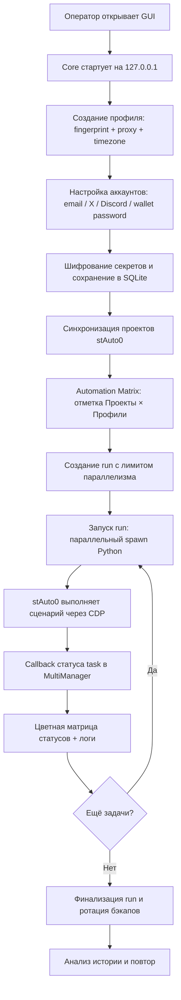

# Бизнес-требования (BRD) — MultiManager v2.0.0

## 1. Цель доработки

Сформулировать и зафиксировать бизнес-требования к продукту **MultiManager** — десктопной AI-Driven Web Automation Platform на базе антидетект-браузера (MVP-аналог AdsPower + ферма автоматизации). BRD служит входом для системного аналитика, который на его основе построит функциональные (FR) и системные (SR) требования.

## 2. Текущая ситуация AS-IS

МultiManager v2.0.0 уже развёрнут как работающий MVP с жёстким разделением на Core (Node.js + Express + better-sqlite3) и GUI (Electron + Vue 3). Согласно аудиту исходного TS.md:

- ✅ Реализованы: локальный REST API + WebSocket, авторизация Bearer-token, SQLite WAL/ACID, генератор отпечатков, менеджер прокси, импорт/экспорт cookies, Multi-Control v0.13.0, human-like typing, менеджер расширений, anti-zombie контроль процессов, hot backup с rolling window 7 дней, AES-256-GCM шифрование секретов, интеграционные endpoints для stAuto0, авто-логин Zerion, встроенный терминал xterm.js, Settings с i18n/темизацией/tray/auto-update.
- ✅ Реализована Automation Matrix (Ф7): таблицы `projects`, `project_profile_config`, `runs`, `run_tasks`; endpoints `/api/projects`, `/api/matrix`, `/api/runs`; GUI-экраны Матрица / Задачи / История.
- ⚠️ Частично: Cookie drag-and-drop + валидатор; Window Arranger (Windows-only, PowerShell-зависим).
- ❌ Заморожено: Migration Wizard (AdsPower/Dolphin{anty}); Cloud Sync.

Продукт позиционируется как инструмент мультиаккаунтинга, дроп-охоты, квестов и Web3-автоматизации; приватные ключи и сид-фразы по дизайну не хранятся в БД.

## 3. Желаемое состояние TO-BE

Работающий, стабильный и безопасный MVP, который позволяет:

1. Создавать и управлять множеством изолированных браузерных профилей с уникальными цифровыми отпечатками, прокси, куками, расширениями и социальными/почтовыми/кошельковыми аккаунтами.
2. Запускать массовые автоматизированные сценарии (Python-скрипты stAuto0) через матрицу «Проекты × Профили» с контролем параллелизма, статусов и логов.
3. Обеспечивать безопасное локальное хранение чувствительных данных (пароли, токены) с шифрованием AES-256-GCM и гибридным мастер-ключом (OS keyring / PBKDF2 / recovery-key).
4. Управлять окнами, прокси, расширениями и процессами из единого GUI с локальным API-доступом для ИИ-агентов.
5. Иметь надёжный backup/rollback и cross-platform поставку (Windows 11 / macOS / Linux).

## 4. Бизнес-ценность

| Метрика | Описание |
|---------|----------|
| Снижение ручного труда | Автоматизация запуска сценариев на десятках профилей вместо ручного управления каждым браузером. |
| Снижение риска банов | Уникальные fingerprint + proxy + cookies + timezone для каждого профиля. |
| Безопасность секретов | Шифрование паролей/токенов; приватные ключи никогда не попадают в БД. |
| Прозрачность операций | Логи по профилям и run, цветная матрица статусов, локальный мониторинг. |
| Масштабируемость | Параллельный запуск с лимитом, матричное назначение проектов на профили. |

## 5. Границы (In/Out of Scope)

### В рамках (In Scope)

- Локальная десктопная платформа (Core + GUI) с REST/WebSocket на `127.0.0.1`.
- Управление профилями браузера: CRUD, fingerprint, proxy, timezone, cookies, extensions, accounts (email/X/Discord), wallet-публичные адреса.
- Автоматизация через Python-скрипты stAuto0 с Automation Matrix, runs, run_tasks.
- Локальное шифрование секретов и hot backup.
- Multi-Control (CDP + native hooks) для синхронизации ввода.
- Window Arranger в текущей Windows-реализации (до cross-platform доработки).
- Cookie import/export и partial GUI для drag-and-drop (улучшение приоритета ниже).

### Вне рамок (Out of Scope)

- Migration Wizard (AdsPower/Dolphin{anty}) — заморожен.
- Cloud Sync — заморожен.
- Хранение приватных ключей / сид-фраз в БД — исключено по дизайну.
- SaaS/серверная версия; удалённый доступ вне `127.0.0.1`.
- Собственный Web3-кошелёк; интеграция только через расширения (Zerion) и внешний stAuto0.

## 6. Допущения и ограничения

- Core и GUI работают на одной машине; токен передаётся через env `PORT` и CLI `--api-token`.
- Пользователь сам отвечает за законность используемых аккаунтов и прокси.
- Python-скрипты автоматизации размещаются в отдельном stAuto0-репозитории; MultiManager предоставляет API и executor.
- Приватные ключи/сиды живут только во временных файлах stAuto0 и уничтожаются после инициализации.

## 7. Глоссарий

| Термин | Описание |
|--------|----------|
| Профиль | Изолированная конфигурация браузера с UA, разрешением, WebGL, proxy, timezone, cookies, расширениями, аккаунтами. |
| Fingerprint / Отпечаток | Набор параметров браузера, имитирующий реального пользователя и снижающий риск детекта. |
| Anti-detect | Технология маскировки браузера под разные устройства/географии. |
| Proxy rotation | Автоматическая смена IP мобильного/резидентного прокси через внешний URL. |
| Multi-Control | Синхронизация мыши/клавиатуры между мастер-окном и slave-окнами профилей. |
| Automation Matrix | Матрица «Проекты × Профили» для массового назначения и запуска сценариев. |
| Run | Групповая задача (batch), состоящая из run_tasks с контролем статуса и лимитом параллелизма. |
| Run task | Одна клетка матрицы в рамках run: проект + профиль. |
| CDP | Chrome DevTools Protocol для управления браузером. |
| stAuto0 | Внешний Python-фреймворк автоматизации Web3/соцсетей, интегрируемый с MultiManager. |
| Zerion | Web3-расширение (кошелёк), для которого реализован авто-логин. |
| Hot backup | Резервная копия БД при холодном старте без остановки приложения. |
| Rolling window | Политика хранения бэкапов: удаление дампов старше 7 дней. |

## 8. Заинтересованные стороны

| Роль | Интерес / Обязанности |
|------|-----------------------|
| Владелец продукта | Приоритизация фич, утверждение scope, бизнес-цели. |
| Оператор фермы (end user) | Создание профилей, запуск сценариев, мониторинг, настройка прокси/аккаунтов. |
| Разработчик Python-скриптов (stAuto0) | Пишет сценарии, использующие API MultiManager; отвечает за логику Web3-автоматизации. |
| Администратор безопасности | Контроль шифрования, мастер-пароля, recovery-key, доступа к internal endpoints. |
| QA / Тестировщик | Проверка функционала, unit/integration тесты (Vitest). |
| Поддержка пользователей | Работа с логами, backup, восстановление. |

## 9. Клиентский путь (CJM)

## 10. User stories

### US-01 Управление профилем
**Я, как оператор фермы, хочу создавать и редактировать браузерные профили с уникальными отпечатками, прокси и аккаунтами, чтобы запускать изолированные сессии для каждого аккаунта.**

Критерии приёмки:
- Создание профиля с авто-генерацией fingerprint по платформе (windows/mac/linux).
- Привязка прокси HTTP/HTTPS/SOCKS5 с проверкой доступности.
- Поля email, X/Twitter, Discord, wallet EVM/Sol адреса и wallet password.
- Timezone обязателен при создании; автоопределение по IP прокси.
- Пароли маскируются в GUI; сохраняются зашифрованными.

### US-02 Массовый запуск автоматизации
**Я, как оператор фермы, хочу назначать Python-сценарии stAuto0 на множество профилей через матрицу и запускать их пакетно, чтобы автоматизировать рутинные Web3-задания.**

Критерии приёмки:
- Проекты синхронизируются из `stAuto0/projects/*.py` + `config/projects.py`.
- Матрица Проекты × Профили с чекбоксами и ограничением по `allowed_profile_ids`.
- Создание run с `parallel_limit`, `total_tasks`.
- Запуск/отмена run из GUI.
- Callback `/api/internal/runs/:id/task-status` обновляет статус клетки.

### US-03 Безопасное хранение секретов
**Я, как администратор безопасности, хочу, чтобы пароли и токены профилей шифровались AES-256-GCM, а мастер-ключ защищался OS keyring или мастер-паролем, чтобы минимизировать риск утечки данных.**

Критерии приёмки:
- Шифруемые колонки: `email_password`, `twitter_password`, `twitter_auth_token`, `discord_password`, `discord_token`, `wallet_password`.
- Формат хранения: `aes-256-gcm:<iv>:<ciphertext>:<tag>`.
- Дефолт: OS Keyring; фоллбэк: `system_config`; опция: мастер-пароль PBKDF2 210k итераций.
- Recovery-key отображается один раз в Settings.
- Приватные ключи/сиды никогда не сохраняются в БД.

### US-04 Мониторинг и контроль процессов
**Я, как оператор, хочу видеть статусы профилей, задач и логи в реальном времени, а также массово останавливать зависшие процессы, чтобы ферма оставалась стабильной.**

Критерии приёмки:
- WebSocket-обновление статусов профилей в GUI.
- Anti-zombie: health-check PID каждые 5 сек; graceful shutdown SIGTERM→8s→SIGKILL.
- `POST /api/browser/shutdown` для массовой остановки.
- Логи профилей и run отдельными файлами с ротацией.
- Встроенный терминал для tail-просмотра логов.

### US-05 Мульти-управление окнами и вводом
**Я, как оператор, хочу синхронизировать действия мыши/клавиатуры между несколькими профилями и упорядочивать окна, чтобы управлять фермой как единым рабочим столом.**

Критерии приёмки:
- Multi-Control v0.13.0: CDP + native hooks, MouseSmoother, human-like typing.
- Tab mapping 1:N мастер→slaves.
- Window Arranger: grid/cascade/focus (текущая Windows-реализация).

## 11. Бизнес-требования (BR-NN)

| ID | Требование | Критерии приёмки | Приоритет |
|----|-----------|------------------|-----------|
| BR-01 | Система должна позволять создавать, редактировать, удалять и запускать браузерные профили с уникальными цифровыми отпечатками. | 1) CRUD профилей через GUI и API; 2) Авто-генерация fingerprint по платформе; 3) Каждый профиль имеет свой `user-data-dir`; 4) Статус `stopped/starting/running` обновляется через WebSocket. | Must |
| BR-02 | Система должна поддерживать управление прокси HTTP/HTTPS/SOCKS5 с проверкой и ротацией. | 1) CRUD прокси; 2) Импорт списком с дедупликацией по `host:port`; 3) `POST /api/proxies/:id/check` через `api.ipify.org`; 4) Ротация мобильных прокси по `rotation_url` с паузой 3 сек; 5) Proxy-строка передаётся браузеру. | Must |
| BR-03 | Система должна шифровать чувствительные данные профилей алгоритмом AES-256-GCM. | 1) Шифруются 6 колонок (см. US-03); 2) Формат хранения — `aes-256-gcm:<iv>:<ciphertext>:<tag>`; 3) Прозрачное encrypt/decrypt в `src/db/queries.js`; 4) Фоллбэк мастер-ключа при недоступности keytar. | Must |
| BR-04 | Система должна предоставлять локальный API для внешних Python-скриптов stAuto0 с аутентификацией. | 1) `/api/internal/profiles?range=...` возвращает cleartext-метрики профилей; 2) `/api/browser/:id/type` для human-like typing; 3) `/api/browser/:id/zerion-login` для авто-логина; 4) Все internal endpoints защищены Bearer-token и помечены `[INTERNAL]` в логах. | Must |
| BR-05 | Система должна реализовывать Automation Matrix для массового назначения и запуска сценариев. | 1) Таблицы `projects`, `project_profile_config`, `runs`, `run_tasks`; 2) `/api/projects/sync` сканирует stAuto0; 3) `/api/matrix` GET/PUT; 4) `/api/runs` POST/start/cancel; 5) RunExecutor с `parallel_limit`; 6) Callback статуса от stAuto0. | Must |
| BR-06 | Система должна обеспечивать управление жизненным циклом процессов браузера и защиту от "зомби". | 1) PID сохраняется в БД; 2) Health-check каждые 5 сек; 3) Graceful shutdown с таймаутом 8 сек и SIGKILL; 4) Массовая остановка через API. | Must |
| BR-07 | Система должна создавать резервные копии БД при старте с rolling window 7 дней. | 1) Hot backup `app.db` при холодном старте; 2) Дампы в `backups/app_YYYYMMDD_HHmmss.db`; 3) Удаление дампов старше 168 часов по `mtime`; 4) Unit-тесты покрывают создание, валидность SQLite, ротацию. | Must |
| BR-08 | Система должна предоставлять GUI для визуального управления профилями, прокси, расширениями, куками, матрицей и логами. | 1) Electron + Vue 3; 2) Экраны: Profile Manager, Proxies, Extensions, Cookie Manager, Window Arranger, Automation Matrix/Runs/History, Settings, Log/API Monitor, Terminal; 3) i18n (en/ru/zh); 4) WebSocket auto-reconnect и статус-бар. | Must |
| BR-09 | Система должна поддерживать импорт/экспорт cookies для профилей. | 1) `GET/POST/DELETE /api/cookies/:profileId`; 2) Форматы JSON и Netscape; 3) Инжекция в `user-data-dir` перед стартом; 4) GUI: drag-and-drop + валидатор (улучшение). | Should |
| BR-10 | Система должна управлять окнами профилей (раскладка grid/cascade/focus). | 1) Endpoints `/api/window-arranger/*`; 2) Группировка по профилям в GUI (улучшение); 3) Cross-platform реализация вместо PowerShell (улучшение). | Should |

## 12. Бизнес-правила (BRULE-NN)

| ID | Правило | Источник |
|----|---------|----------|
| BRULE-01 | Приватные ключи и сид-фразы кошельков **никогда** не сохраняются в БД MultiManager; они существуют только во временных файлах stAuto0 и уничтожаются после инициализации. | TS.md §3.2, §4.11 |
| BRULE-02 | Core открывает HTTP-порт только на `127.0.0.1`; GUI передаёт токен через `--api-token` и порт через env `PORT`. | TS.md §2, §3.4 |
| BRULE-03 | Все HTTP-запросы (кроме `GET /health`) требуют заголовок `Authorization: Bearer <token>`; несовпадение → 401, отсутствие инициализации токена → 503. | TS.md §2 |
| BRULE-04 | Прокси дедуплицируются по паре `host:port` при любом импорте; дубликаты отбрасываются с уведомлением. | TS.md §4.2 |
| BRULE-05 | Профиль обязан иметь `timezone` при создании; timezone определяется автоматически по IP прокси либо задаётся вручную. | TS.md §3.2, §9.1 |
| BRULE-06 | Формат зашифрованного значения должен быть `aes-256-gcm:<iv_hex>:<ciphertext_hex>:<tag_hex>`; ключ в RAM уничтожается при закрытии сессии. | TS.md §4.11 |
| BRULE-07 | Hot backup запускается только при холодном старте; кэш браузеров в backup не попадает. | TS.md §4.10 |
| BRULE-08 | При запуске run количество одновременно выполняемых задач не превышает `parallel_limit`; Executor финализирует статус run после завершения всех run_tasks. | TS.md §3.3, §4.16 |
| BRULE-09 | Проекты в Automation Matrix читаются только с `is_active = 1`; синхронизация обновляет таблицу `projects` из файлов stAuto0. | TS.md §3.3, §4.16 |
| BRULE-10 | Cookie drag-and-drop должен предварительно валидировать JSON/Netscape перед импортом. | TS.md §9.4 |

## 13. Нефункциональные требования (NFR-NN)

| ID | Требование | Критерий | Приоритет |
|----|-----------|----------|-----------|
| NFR-01 | **Безопасность (авторизация).** Локальный API доступен только на `127.0.0.1` и требует Bearer-токен. | Pen-test: запрос с `127.0.0.1` без токена → 401; запрос с внешнего IP отклонён (Core не слушает `0.0.0.0`). | Must |
| NFR-02 | **Безопасность (шифрование).** AES-256-GCM с аутентификацией; мастер-ключ защищён OS keyring или PBKDF2. | Успешное encrypt/decrypt/rotate в unit-тестах; отсутствие plaintext паролей в SQLite. | Must |
| NFR-03 | **Надёжность (backup).** Hot backup не нарушает работу БД; rolling window 7 дней. | 8 unit-тестов проходят; ручная проверка restore из `.db`. | Must |
| NFR-04 | **Надёжность (anti-zombie).** Процессы браузера не остаются висеть после stop/shutdown. | Health-check каждые 5 сек; graceful shutdown завершает PID в течение 10 сек. | Must |
| NFR-05 | **Производительность (API).** REST-ответы для CRUD профилей/прокси ≤ 200 мс на локальной машине. | Load test: 100 последовательных запросов, p95 < 200 мс. | Should |
| NFR-06 | **Производительность (Automation Matrix).** Запуск run с 100 задачами инициализируется ≤ 5 сек; параллельный лимит соблюдается. | Тестовый run с `parallel_limit=10`, 100 tasks — старт ≤ 5 сек, одновременно ≤ 10 процессов. | Should |
| NFR-07 | **Портативность.** Кроссплатформенная сборка: Windows 11 (NSIS), macOS (DMG), Linux (AppImage). | CI собирает артефакты для трёх ОС; smoke-test запуска GUI. | Must |
| NFR-08 | **Логирование и наблюдаемость.** Логи профилей синхронные (pino sync); логи run пишутся в `logs/runs/{run_id}/`. | Проверка наличия файлов логов после запуска/остановки профиля и run. | Must |
| NFR-09 | **Тестируемость.** Покрытие unit + integration тестами Vitest; новые модули сопровождаются тестами. | ≥ 654 тестов; новый код имеет unit-тесты; CI `npm test` зелёный. | Should |
| NFR-10 | **UX / Локализация.** GUI поддерживает en/ru/zh; язык сохраняется в SQLite. | Ручная проверка переключения языка и сохранения настройки. | Should |
| NFR-11 | **Отказоустойчивость (WebSocket).** GUI автоматически переподключается к Core при разрыве с exponential backoff 1→2→4→8 сек. | Симуляция разрыва соединения → восстановление ≤ 15 сек. | Should |

## 14. Нормативные требования (REG-NN)

| ID | Требование | Источник / Обоснование |
|----|-----------|------------------------|
| REG-01 | Продукт не должен способствовать нарушению ToS сервисов и законодательства; аккаунты и действия пользователя находятся в его зоне ответственности. | Общие требования безопасного и этичного использования automation-инструментов. |

## 15. Риски (R-NN)

| ID | Риск | Вероятность | Влияние | Митигация |
|----|------|-------------|---------|-----------|
| R-01 | **Утечка internal endpoint-токена** через логи/скриншоты Settings. | Средняя | Высокое | Токен маскируется в логах; GUI копирует через secure clipboard; рекомендуется master-password. |
| R-02 | **Повреждение БД** при сбое питания во время записи. | Низкая | Высокое | WAL + ACID, hot backup при старте, rolling window 7 дней. |
| R-03 | **"Зомби"-процессы браузера** при нештатном завершении Core/GUI. | Средняя | Среднее | Anti-zombie health-check каждые 5 сек; shutdown endpoint; graceful→force kill. |
| R-04 | **Детект антидетекта** сайтами из-за неправильного fingerprint/proxy/timezone. | Средняя | Высокое | Логические проверки генератора; авто timezone по IP; proxy checker; регулярное обновление fingerprint DB. |
| R-05 | **Зависимость от PowerShell** делает Window Arranger Windows-only. | Высокая | Среднее | В Roadmap/ToDo §4 запланирована cross-platform замена ( native Win32 / AppleScript / xdotool ). |
| R-06 | **Cookie drag-and-drop без валидации** может привести к импорту битых/вредоносных cookies. | Средняя | Среднее | Реализовать пре-валидатор JSON/Netscape перед импортом (ToDo §2). |
| R-07 | **Потеря recovery-key** при использовании master-password лишит доступа к зашифрованным данным. | Средняя | Высокое | Показ recovery-key один раз; рекомендация сохранить в менеджер паролей; фоллбэк на OS keyring. |
| R-08 | **Интеграция со stAuto0** может нарушиться при изменении API/контракта Python-скриптов. | Средняя | Среднее | Версионирование API, callback-контракт, совместное тестирование по TS_INTEGRATION.md. |

## 16. Предпосылки для системных требований

- **Язык/рантайм Core:** Node.js ≥ 20.x, Express 4.x.
- **БД:** SQLite через `better-sqlite3` с WAL и `foreign_keys=ON`.
- **GUI:** Electron + Vue 3 + Vite + Tailwind + Ant Design Vue.
- **Тестирование:** Vitest v3.x, 654+ тестов.
- **Автоматизация:** внешний Python-фреймворк stAuto0; MultiManager предоставляет API и executor.
- **Развёртывание:** десктопный инсталлятор (NSIS/DMG/AppImage); Core стартует локально, GUI fork'ает Core.
- **Среда разработки:** кроссплатформенная (Windows 11 / macOS / Linux); `npm` + `node` + виртуальное окружение Python для stAuto0.

## 17. DoR / DoD верификация

### Definition of Ready (DoR)

| # | Критерий | Статус |
|---|----------|--------|
| D1 | Бизнес-заказчик / владелец продукта идентифицирован | ✅ Оператор фермы + владелец продукта |
| D2 | Проблема описана (AS-IS + TO-BE) | ✅ Разделы 2–3 |
| D3 | Цель заявлена | ✅ Раздел 1 |
| D4 | User story с критериями приёмки | ✅ Раздел 10 |
| D5 | CJM / BPMN присутствует | ✅ Раздел 9 |
| D6 | Заинтересованные стороны / департаменты перечислены | ✅ Раздел 8 |
| D7 | Системы / сервисы идентифицированы | ✅ Core, GUI, stAuto0, SQLite, CDP, OS keyring |
| D12 | NFR по потреблению ресурсов заявлены | ✅ NFR-05, NFR-06 |
| D13 | NFR по производительности / нагрузке заявлены | ✅ NFR-05, NFR-06, NFR-08 |
| D14 | Хотя бы одно бизнес-правило описано | ✅ Раздел 12 (BRULE-01–BRULE-10) |

**DoR: 10/10 обязательных пройдено → ГОТОВ.**

### Definition of Done (DoD)

| # | Критерий | Статус |
|---|----------|--------|
| DD1 | Все разделы BRD заполнены | ✅ |
| DD2 | Каждое BR имеет критерии приёмки | ✅ Раздел 11 |
| DD3 | Каждое бизнес-правило имеет источник | ✅ Раздел 12 |
| DD4 | Каждое REG имеет нормативный источник | ✅ Раздел 14 |
| DD5 | Нет блокирующих открытых вопросов | ⚠️ Есть неблокирующие вопросы в разделе 18 |
| DD6 | Заинтересованные стороны заполнены | ✅ |
| DD7 | Предпосылки для SR заполнены | ✅ Раздел 16 |
| DD8 | **HUMAN GATE** — требуется ревью бизнес-заказчика | ⚠️ Требуется внешнее подтверждение |
| DD9 | MD-файл сохранён в проекте | ✅ `/home/hermes_ai/my_agent/AI-harness/projects/multimanager-brd-review/brd.md` |

**DoD: 8/10 → УСЛОВНО ГОТОВ (требуется HUMAN GATE).**

## 18. Открытые вопросы

| # | Вопрос | Владелец | Статус |
|---|--------|----------|--------|
| Q-01 | Подтвердить приоритет Cookie drag-and-drop + валидатора относительно других улучшений. | Владелец продукта | Открыт |
| Q-02 | Нужна ли поддержка Window Arranger на macOS/Linux в ближайшем релизе или достаточно Windows-only MVP? | Владелец продукта | Открыт |
| Q-03 | Будет ли Migration Wizard и Cloud Sync разморожены? Если да — целевые сроки и приоритет. | Владелец продукта | Открыт |
| Q-04 | Требуется ли интеграция с другими кошельками кроме Zerion (MetaMask, Rabby и т.д.)? | Владелец продукта | Открыт |
| Q-05 | Какие регуляторные/юридические требования применимы к хранению cookies/аккаунтов в конкретных юрисдикциях пользователей? | Юрист / Владелец продукта | Открыт |
| Q-06 | Требуется ли SaaS/remote-управление профилями в будущем (влияет на текущую архитектуру `127.0.0.1`)? | Архитектор / Владелец продукта | Открыт |

---

**Ключевые идентификаторы для traceability matrix:**
- BR: BR-01 … BR-10
- BRULE: BRULE-01 … BRULE-10
- NFR: NFR-01 … NFR-11
- R: R-01 … R-08
- REG: REG-01
- US: US-01 … US-05

Файл сохранён: `/home/hermes_ai/my_agent/AI-harness/projects/multimanager-brd-review/brd.md`
