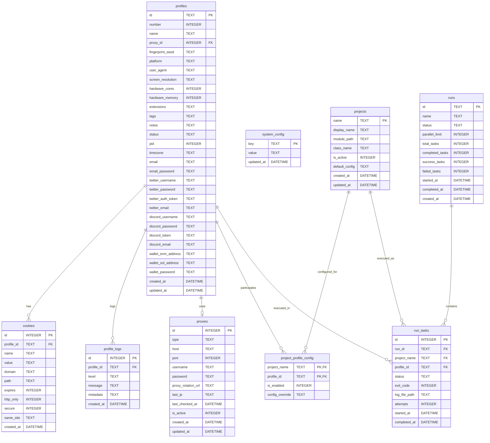
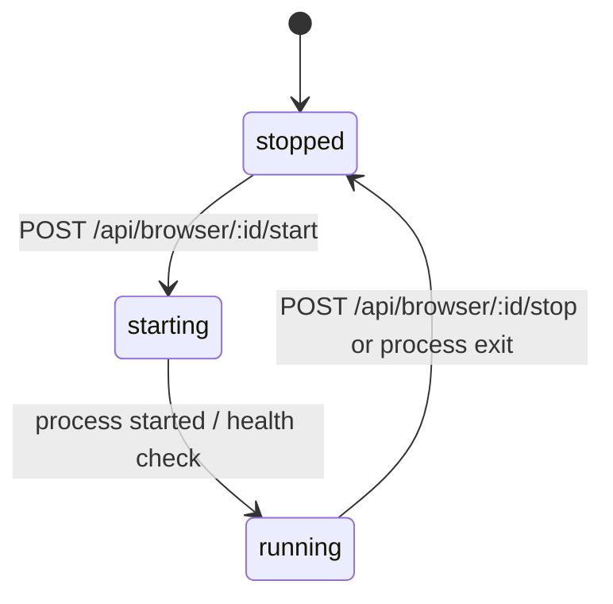
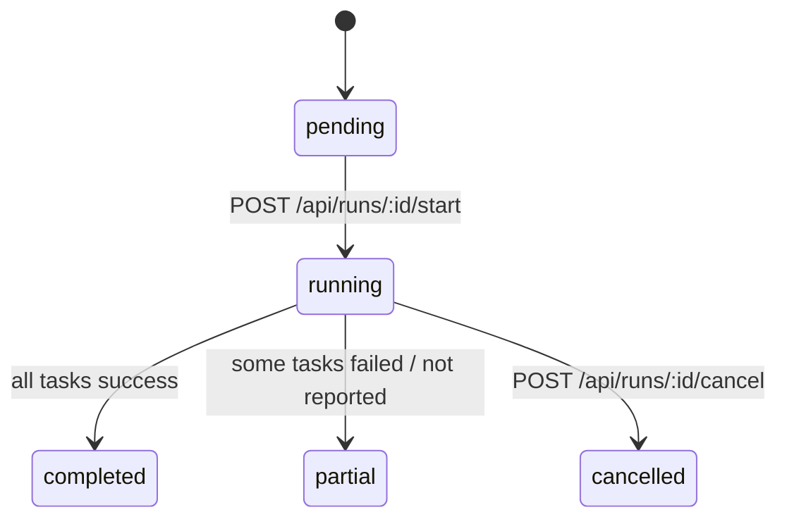
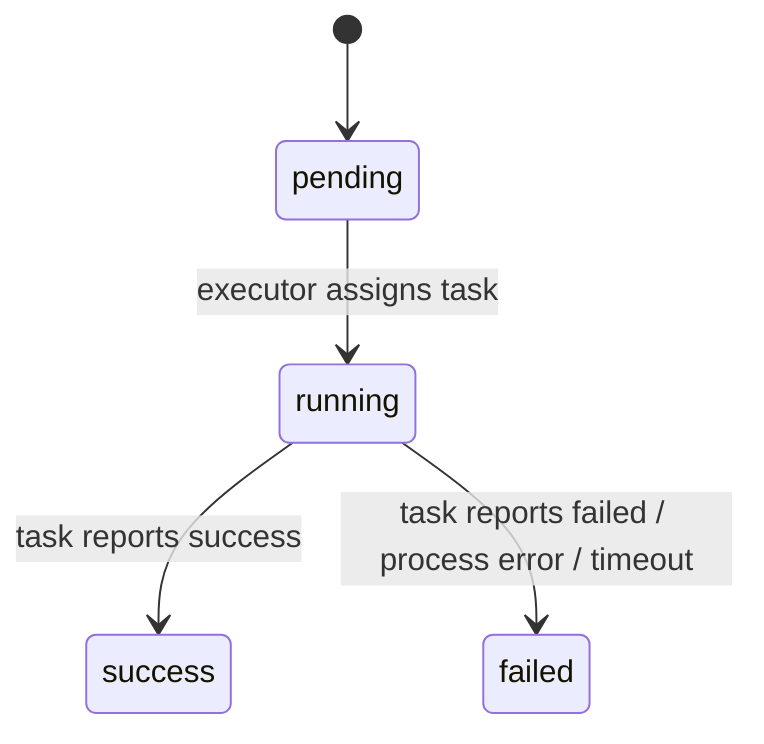

<!-- Spec: /home/hermes_ai/my_agent/AI-harness/projects/multimanager-brd-review/source_ts.md | Schema: /home/hermes_ai/my_agent/AI-harness/projects/multimanager-code/src/db/schema.js | Generated: 2026-07-19 -->

# Data Model: MultiManager

## 1. ER Diagram

## 2. Entities

### profiles

| Parameter | Description | Required | Type | Comment |
|-----------|-------------|----------|------|---------|
| id | Unique profile identifier | Y | TEXT | UUIDv4, PK |
| number | Sequential profile number | Y | INTEGER | Unique human-readable |
| name | Profile name | Y | TEXT | e.g. auto_001 |
| proxy_id | Linked proxy | N | INTEGER | FK → proxies(id), ON DELETE SET NULL |
| fingerprint_seed | Seed for consistent fingerprint | Y | TEXT | |
| platform | OS platform | Y | TEXT | CHECK windows/macos/linux |
| user_agent | Browser UA string | Y | TEXT | |
| screen_resolution | Display resolution | Y | TEXT | |
| hardware_cores | CPU cores hint | Y | INTEGER | |
| hardware_memory | RAM hint | Y | INTEGER | |
| extensions | Extension IDs | N | TEXT | JSON array, default [] |
| tags | Profile tags | N | TEXT | JSON array, default [] |
| notes | Free text notes | N | TEXT | default '' |
| status | Runtime status | N | TEXT | CHECK stopped/starting/running, default stopped |
| pid | Browser process id | N | INTEGER | |
| timezone | Browser timezone | N | TEXT | |
| email | Email account | N | TEXT | |
| email_password | Encrypted email password | N | TEXT | |
| twitter_username | X/Twitter login | N | TEXT | |
| twitter_password | Encrypted X password | N | TEXT | |
| twitter_auth_token | X auth token | N | TEXT | |
| twitter_email | X email | N | TEXT | |
| discord_username | Discord login | N | TEXT | |
| discord_password | Encrypted Discord password | N | TEXT | |
| discord_token | Discord token | N | TEXT | |
| discord_email | Discord email | N | TEXT | |
| wallet_evm_address | EVM wallet public address | N | TEXT | |
| wallet_sol_address | Solana wallet public address | N | TEXT | |
| wallet_password | Encrypted wallet extension password | N | TEXT | |
| created_at | Creation timestamp | N | DATETIME | DEFAULT CURRENT_TIMESTAMP |
| updated_at | Last update timestamp | N | DATETIME | DEFAULT CURRENT_TIMESTAMP, updated via trigger |

### proxies

| Parameter | Description | Required | Type | Comment |
|-----------|-------------|----------|------|---------|
| id | Proxy identifier | Y | INTEGER | AUTOINCREMENT, PK |
| type | Proxy protocol | Y | TEXT | CHECK http/https/socks5 |
| host | Proxy host | Y | TEXT | |
| port | Proxy port | Y | INTEGER | |
| username | Auth username | N | TEXT | stored plaintext |
| password | Auth password | N | TEXT | stored plaintext |
| proxy_rotation_url | Rotation endpoint | N | TEXT | |
| last_ip | Last known exit IP | N | TEXT | |
| last_checked_at | Last check timestamp | N | DATETIME | |
| is_active | Active flag | N | INTEGER | default 1 |
| created_at | Creation timestamp | N | DATETIME | DEFAULT CURRENT_TIMESTAMP |
| updated_at | Last update timestamp | N | DATETIME | DEFAULT CURRENT_TIMESTAMP, updated via trigger |

### cookies

| Parameter | Description | Required | Type | Comment |
|-----------|-------------|----------|------|---------|
| id | Cookie record id | Y | INTEGER | AUTOINCREMENT, PK |
| profile_id | Owner profile | Y | TEXT | FK → profiles(id), ON DELETE CASCADE |
| name | Cookie name | Y | TEXT | |
| value | Cookie value | Y | TEXT | |
| domain | Cookie domain | Y | TEXT | |
| path | Cookie path | N | TEXT | default '/' |
| expires | Expiration epoch | N | INTEGER | default -1 |
| http_only | HttpOnly flag | N | INTEGER | default 0 |
| secure | Secure flag | N | INTEGER | default 0 |
| same_site | SameSite policy | N | TEXT | default 'Lax' |
| created_at | Creation timestamp | N | DATETIME | DEFAULT CURRENT_TIMESTAMP |

### profile_logs

| Parameter | Description | Required | Type | Comment |
|-----------|-------------|----------|------|---------|
| id | Log record id | Y | INTEGER | AUTOINCREMENT, PK |
| profile_id | Owner profile | Y | TEXT | FK → profiles(id), ON DELETE CASCADE |
| level | Log level | Y | TEXT | CHECK info/warn/error/debug |
| message | Log message | Y | TEXT | |
| metadata | Structured metadata | N | TEXT | JSON, default {} |
| created_at | Creation timestamp | N | DATETIME | DEFAULT CURRENT_TIMESTAMP |

### system_config

| Parameter | Description | Required | Type | Comment |
|-----------|-------------|----------|------|---------|
| key | Config key | Y | TEXT | PK |
| value | Config value | Y | TEXT | |
| updated_at | Last update timestamp | N | DATETIME | DEFAULT CURRENT_TIMESTAMP, updated via trigger |

### projects

| Parameter | Description | Required | Type | Comment |
|-----------|-------------|----------|------|---------|
| name | Project module name | Y | TEXT | PK (filename without .py) |
| display_name | Human-readable name | N | TEXT | default '' |
| module_path | Python import path | N | TEXT | default '' |
| class_name | Entry class name | N | TEXT | default '' |
| is_active | Active flag | N | INTEGER | default 1 |
| default_config | Default parameters | N | TEXT | JSON, default {} |
| created_at | Creation timestamp | N | DATETIME | DEFAULT CURRENT_TIMESTAMP |
| updated_at | Last update timestamp | N | DATETIME | DEFAULT CURRENT_TIMESTAMP, updated via trigger |

### project_profile_config

| Parameter | Description | Required | Type | Comment |
|-----------|-------------|----------|------|---------|
| project_name | Project | Y | TEXT | PK, FK → projects(name), ON DELETE CASCADE |
| profile_id | Profile | Y | TEXT | PK, FK → profiles(id), ON DELETE CASCADE |
| is_enabled | Enabled flag | N | INTEGER | default 0 |
| config_override | Per-pair override | N | TEXT | JSON, default {} |

### runs

| Parameter | Description | Required | Type | Comment |
|-----------|-------------|----------|------|---------|
| id | Run identifier | Y | TEXT | UUIDv4, PK |
| name | Run name | N | TEXT | default '' |
| status | Run status | N | TEXT | CHECK pending/running/completed/partial/cancelled, default pending |
| parallel_limit | Max concurrent profiles | N | INTEGER | default 2 |
| total_tasks | Total run tasks | N | INTEGER | default 0 |
| completed_tasks | Completed count | N | INTEGER | default 0 |
| success_tasks | Successful count | N | INTEGER | default 0 |
| failed_tasks | Failed count | N | INTEGER | default 0 |
| started_at | Start timestamp | N | DATETIME | |
| completed_at | Completion timestamp | N | DATETIME | |
| created_at | Creation timestamp | N | DATETIME | DEFAULT CURRENT_TIMESTAMP |

### run_tasks

| Parameter | Description | Required | Type | Comment |
|-----------|-------------|----------|------|---------|
| id | Task record id | Y | INTEGER | AUTOINCREMENT, PK |
| run_id | Parent run | Y | TEXT | FK → runs(id), ON DELETE CASCADE |
| project_name | Executed project | Y | TEXT | FK → projects(name) |
| profile_id | Executed profile | Y | TEXT | FK → profiles(id) |
| status | Task status | N | TEXT | CHECK pending/running/success/failed, default pending |
| exit_code | Process exit code | N | INTEGER | |
| log_file_path | Path to log file | N | TEXT | |
| attempts | Retry attempts | N | INTEGER | |
| started_at | Start timestamp | N | DATETIME | |
| completed_at | Completion timestamp | N | DATETIME | |

## 3. State Machines

### profiles.status

| From | To | Condition |
|------|----|-----------|
| stopped | starting | User calls start |
| starting | running | Browser process reported DevTools port / health ok |
| running | stopped | User calls stop or process exited |

### runs.status

| From | To | Condition |
|------|----|-----------|
| pending | running | User calls start |
| running | completed | All run_tasks success |
| running | partial | Any task failed or never reported |
| running | cancelled | User calls cancel |

### run_tasks.status

| From | To | Condition |
|------|----|-----------|
| pending | running | RunExecutor starts profile execution |
| running | success | Internal endpoint reports success |
| running | failed | Internal endpoint reports failed or child exit without report |

## 4. Idempotency / Uniqueness

| Entity | Unique / Idempotency Rule |
|--------|---------------------------|
| profiles | `number` is unique sequential; `name` appears unique by convention but no UNIQUE constraint |
| proxies | No unique constraint; queries.findByHostPort checks host+port manually |
| project_profile_config | Composite PK (project_name, profile_id) prevents duplicate pairs |
| runs | PK id (UUIDv4) |
| run_tasks | AUTOINCREMENT id; no unique constraint on (run_id, project_name, profile_id) |
| projects | PK name (filename without .py) |
| system_config | PK key |

**Observation:** `run_tasks` has no unique index on `(run_id, project_name, profile_id)`. If sync or executor bug duplicates batch insert, the table may contain duplicate cells. Recommended: add `UNIQUE(run_id, project_name, profile_id)`.

## 5. Spec vs Schema Gaps

| # | Type | Description | Severity |
|---|------|-------------|----------|
| 1 | Spec undercount | Spec §3.1 lists 5 tables; schema has 9 | Medium |
| 2 | Missing encryption detail | Spec says passwords encrypted, schema stores TEXT; encryption happens at application layer | Medium |
| 3 | Proxy credentials plaintext | Schema stores username/password as TEXT without encryption marker | Medium |
| 4 | Missing unique constraint | `run_tasks` has no UNIQUE(run_id, project_name, profile_id) | Low |
| 5 | profiles.name not UNIQUE | Convention-based uniqueness, no DB constraint | Low |
| 6 | Trigger inconsistency | `proxies`, `profiles`, `projects`, `system_config` have update triggers; `cookies`, `profile_logs`, `run_tasks`, `runs` do not | Low |

## 6. Open Questions

| # | Question | Impact |
|---|----------|--------|
| 1 | Should proxy credentials be encrypted at rest? | Security compliance |
| 2 | Should `profiles.name` have a UNIQUE constraint? | Data integrity |
| 3 | Should `run_tasks` enforce uniqueness per (run_id, project_name, profile_id)? | Prevents duplicate matrix cells |
| 4 | How are encryption keys rotated when column set expands (NEW_PROFILE_COLUMNS)? | Migration strategy |

## 7. Indexes

| Index | Table | Columns | Purpose |
|-------|-------|---------|---------|
| idx_profiles_status | profiles | status | Filter by runtime status |
| idx_profiles_proxy_id | profiles | proxy_id | Join with proxies |
| idx_proxies_host_port | proxies | host, port | Duplicate check / lookup |
| idx_cookies_profile_id | cookies | profile_id | Fetch cookies by profile |
| idx_profile_logs_profile_id | profile_logs | profile_id | Fetch logs by profile |
| idx_profile_logs_created_at | profile_logs | created_at | Time-based log queries |
| idx_project_profile_config_project | project_profile_config | project_name | Fetch by project |
| idx_project_profile_config_profile | project_profile_config | profile_id | Fetch by profile |
| idx_runs_status | runs | status | Filter runs by status |
| idx_runs_created_at | runs | created_at | Time-based run queries |
| idx_run_tasks_run_id | run_tasks | run_id | Fetch tasks by run |
| idx_run_tasks_profile_id | run_tasks | profile_id | Fetch tasks by profile |

## 8. Migrations

- `createTables` initializes all tables and indexes on fresh DB.
- `migrateTables` uses `ALTER TABLE ADD COLUMN` for `NEW_PROFILE_COLUMNS` and creates automation tables if missing.
- No down-migrations or version table.
- Triggers auto-update `updated_at` on `profiles`, `proxies`, `projects`, `system_config`.
