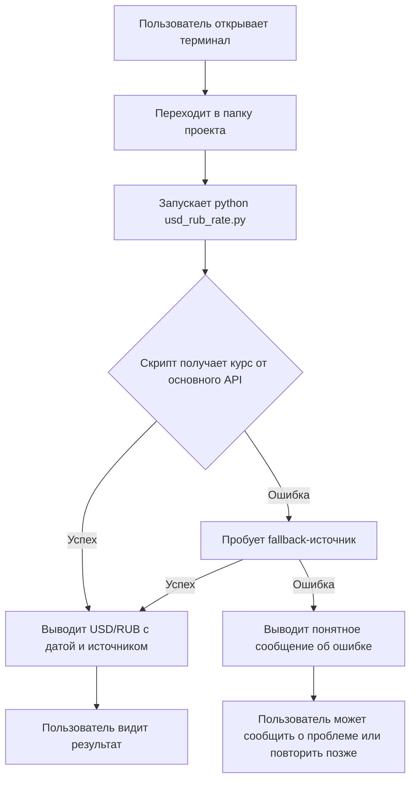

# Бизнес-требования (БФТ): Скрипт USD/RUB

## 1. Цель доработки

Создать небольшой самостоятельный Python-скрипт, который запрашивает и показывает актуальный курс обмена USD/RUB из бесплатного публичного источника.

## 2. Текущая ситуация AS-IS

- Пользователь проверяет курс USD/RUB вручную через сайт ЦБ РФ, банки или агрегаторы.
- Для автоматизации нет простого консольного инструмента в проекте.
- Нет централизованного скрипта, который можно запустить локально без сторонних зависимостей.

## 3. Желаемое состояние TO-BE

- В проекте `usd-rub-rate` лежит скрипт `usd_rub_rate.py`.
- Пользователь запускает скрипт из терминала и сразу видит текущий курс USD/RUB.
- Источник — бесплатный публичный API (приоритет: ЦБ РФ, fallback: exchangerate-api.com/open.er-api.com).
- Скрипт работает только на стандартной библиотеке Python 3, если возможно.

## 4. Бизнес-ценность

- Экономия времени: мгновенное получение курса без открытия браузера.
- Независимость от внешних сервисов и платных API.
- База для дальнейших доработок (история, конвертация, уведомления).

## 5. Границы

- Только курс USD/RUB.
- Только консольный вывод.
- Нет сохранения истории, графиков, UI и базы данных.
- Нет аутентификации и личных кабинетов.

## 6. Допущения и ограничения

- Пользователь имеет Python 3.11+.
- Устройство имеет доступ в интернет.
- Бесплатный API может иметь ограничения по частоте запросов.
- Точность курса ограничена выбранным источником.

## 7. Глоссарий

| Термин | Определение |
|--------|-------------|
| USD/RUB | Курс обмена доллара США к российскому рублю. |
| ЦБ РФ | Центральный банк Российской Федерации, официальный источник курса. |
| Stdlib-only | Использование только стандартной библиотеки Python, без pip-зависимостей. |
| API | Программный интерфейс для получения данных по сети. |

## 8. User story

**US-01**

> **Я, как** пользователь, который следит за курсом доллара,  
> **хочу** запустить скрипт и увидеть актуальный курс USD/RUB,  
> **чтобы** быстро узнать текущий обменный курс без открытия браузера.

**Критерии приёмки:**
1. Скрипт запускается командой `python usd_rub_rate.py`.
2. В консоли выводится текущий курс USD/RUB.
3. Рядом с курсом отображается источник данных и дата/время актуальности.
4. При недоступности основного источника скрипт пытается fallback-источник.
5. Если данные получить не удалось — выводится понятная ошибка.

## 9. Клиентский путь (CJM)

## 10. Нормативные требования (REG-NN)

*Не применимо: решение не обрабатывает персональные данные и не регулируется финансовым законодательством как платёжный сервис.*

## 11. Бизнес-требования (BR-NN)

### BR-01 — Получение курса USD/RUB

**Описание:** Скрипт должен запрашивать актуальный курс USD/RUB из публичного источника.

**Критерии приёмки:**
- Основной источник: неофициальный mirror ЦБ РФ (`https://www.cbr-xml-daily.ru/daily_json.js`). Данные предоставляются сторонним сервисом; для критичных расчётов рекомендуется использовать официальный API ЦБ РФ.
- При недоступности основного источника используется fallback: `https://open.er-api.com/v6/latest/USD` или аналогичный бесплатный API.

**Приоритет:** Must have.

### BR-02 — Консольный вывод

**Описание:** Результат должен отображаться в терминале в удобном для чтения виде.

**Критерии приёмки:**
- Формат вывода: `USD/RUB: <курс> (источник: <источник>, дата: <дата_время>)`.
- Курс отформатирован с двумя знаками после запятой.

**Приоритет:** Must have.

### BR-03 — Отсутствие внешних зависимостей

**Описание:** Скрипт должен работать на стандартной библиотеке Python.

**Критерии приёмки:**
- Для запуска достаточно интерпретатора Python 3.
- Не требуется установка пакетов через `pip`.

**Приоритет:** Must have.

### BR-04 — Обработка ошибок

**Описание:** При сбоях сети или API скрипт должен сообщать пользователю понятную ошибку.

**Критерии приёмки:**
- При недоступности всех источников выводится: "Не удалось получить курс USD/RUB. Проверьте подключение к интернету."
- Скрипт завершается с ненулевым кодом при ошибке.

**Приоритет:** Must have.

## 12. Бизнес-правила (BRULE-NN)

### BRULE-01 — Приоритет источников

Основной источник курса — ЦБ РФ. Fallback-источник используется только если основной недоступен или вернул ошибку.

### BRULE-02 — Форматирование курса

Курс USD/RUB выводится с двумя знаками после запятой (например, `92.45`).

### BRULE-03 — Временная метка

Рядом с курсом указывается дата актуальности данных по московскому времени (UTC+3) или временная метка из ответа API.

## 13. Нефункциональные требования (NFR-NN)

### NFR-01 — Производительность

- Время от запуска до вывода результата не более 10 секунд при нормальном интернет-соединении.

### NFR-02 — Надёжность

- Скрипт должен корректно завершаться при недоступности API, без traceback по умолчанию.
- Поддерживается не менее одного fallback-источника.

### NFR-03 — Безопасность

- Скрипт не хранит и не передаёт персональные данные.
- Не используются API-ключи и секреты.

### NFR-04 — Потребление ресурсов

- Скрипт не требует установки сторонних библиотек.
- Размер исходного файла не превышает 50 КБ.

## 14. Риски (R-NN)

### R-01 — Изменение API источника

**Описание:** Неофициальный mirror `cbr-xml-daily.ru` или fallback-источник могут изменить URL или формат ответа, либо прекратить работу.  
**Вероятность:** Средняя.  
**Влияние:** Среднее.  
**Митигация:** Использовать fallback, версионировать скрипт, добавить тест на парсинг ответа, а для критичных расчётов переключаться на официальный API ЦБ РФ.

### R-02 — Блокировка бесплатного API

**Описание:** Публичный API может ограничить количество запросов или заблокировать IP.  
**Вероятность:** Низкая.  
**Влияние:** Низкое.  
**Митигация:** Использовать fallback-источник, кэшировать последний успешный результат (опционально, вне MVP).

### R-03 — Отсутствие интернета у пользователя

**Описание:** Без сети скрипт не сможет получить данные.  
**Вероятность:** Высокая в некоторых сценариях.  
**Влияние:** Низкое.  
**Митигация:** Вывод понятного сообщения об ошибке.

## 15. Заинтересованные стороны и зависимости

| Роль | Интерес |
|------|---------|
| Пользователь скрипта | Быстро получать актуальный курс USD/RUB. |
| Разработчик | Реализовать скрипт по BRD и передать тестировщику. |
| Тестировщик | Проверить корректность работы и обработку ошибок. |

**Зависимости:**
- Доступность интернета.
- Доступность публичных API ЦБ РФ и/или fallback-источника.

## 16. Предпосылки для системных требований

- Язык реализации: Python 3.
- Использование модуля `urllib.request` (stdlib) для HTTP-запросов.
- Использование модуля `json` для парсинга ответа.
- Кодировка вывода: UTF-8.

## 17. Проверка готовности к разработке (DoR)

| # | Критерий | Статус |
|---|----------|--------|
| D1 | Бизнес-заказчик / пользователь идентифицирован | ✅ |
| D2 | Проблема описана (AS-IS + TO-BE) | ✅ |
| D3 | Цель описана | ✅ |
| D4 | User story с критериями приёмки | ✅ |
| D5 | CJM / BPMN присутствует | ✅ |
| D6 | Заинтересованные стороны перечислены | ✅ |
| D7 | Системы / сервисы идентифицированы | ✅ |
| D12 | Требования по потреблению NFR | ✅ |
| D13 | Требования по производительности / нагрузке NFR | ✅ |
| D14 | Как минимум одно BR существует | ✅ |

**DoR: 10/10 обязательных пройдено → ГОТОВ.**

## 18. Проверка завершения (DoD)

| # | Критерий | Статус |
|---|----------|--------|
| DD1 | Все разделы БФТ заполнены | ✅ |
| DD2 | У каждого BR есть критерии приёмки | ✅ |
| DD3 | У каждого бизнес-правила есть источник / обоснование | ✅ |
| DD4 | REG либо не применимо, либо имеет нормативный источник | ✅ |
| DD5 | Нет блокирующих открытых вопросов | ✅ |
| DD6 | Заинтересованные стороны заполнены | ✅ |
| DD7 | Предпосылки для системных требований заполнены | ✅ |
| DD8 | **HUMAN GATE** — требуется ревью заказчика | ⏳ |
| DD9 | MD-файл сохранён в проекте | ✅ |

**DoD: 9/10** — ожидается ревью бизнес-заказчика (DD8).

## 19. Открытые вопросы

*Нет блокирующих вопросов.*
