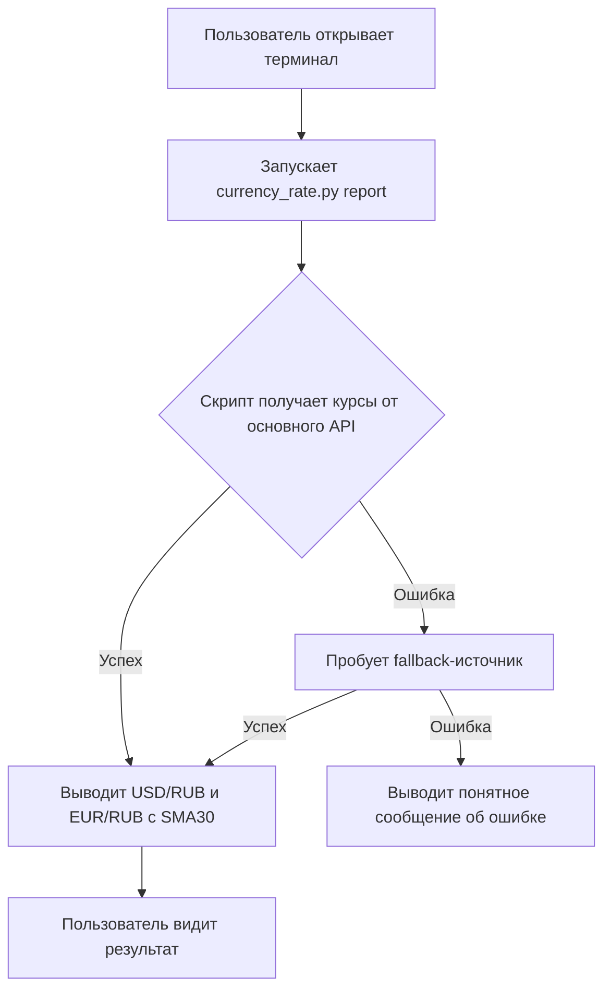
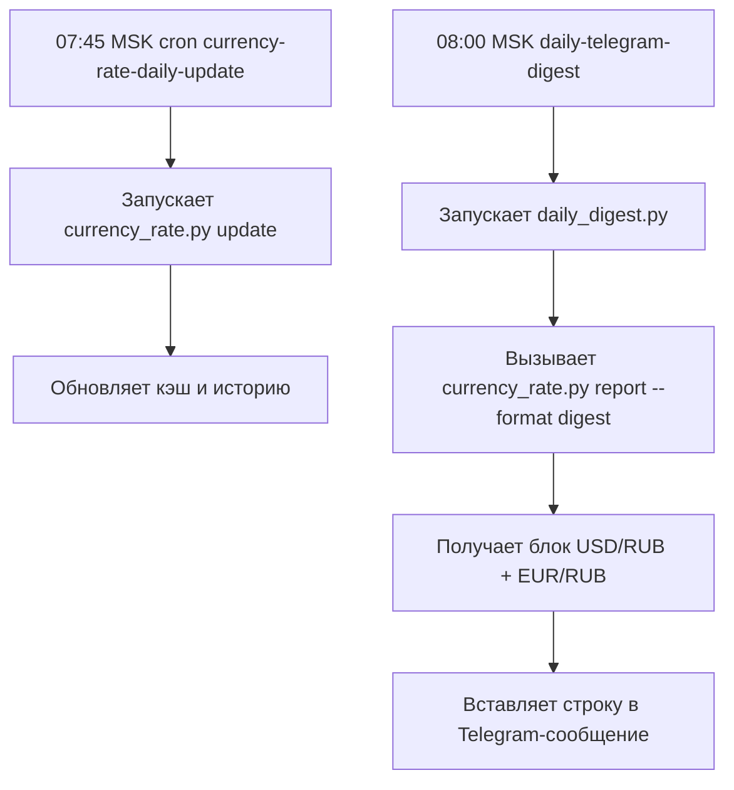

# Бизнес-требования (БФТ): Мультивалютный скрипт курсов USD/RUB и EUR/RUB v2.0

## 1. Цель доработки

Расширить консольный Python-скрипт получения валютных курсов так, чтобы он:
- поддерживал обе пары — USD/RUB и EUR/RUB;
- хранил историю котировок за 90 дней;
- вычислял 30-дневную скользящую среднюю (SMA30);
- обновлял данные тихо по расписанию (cron) ежедневно в 07:45 по московскому времени (перед дайджестом);
- поставлял краткую сводку курсов для ежедневного Telegram-дайджеста.

## 2. Текущая ситуация AS-IS

- В проекте уже реализован базовый скрипт `usd_rub_rate.py`, который выводит только USD/RUB без истории и без расписания.
- Новый скрипт `currency_rate.py` (v2.0.0) уже создан и содержит поддержку USD/RUB и EUR/RUB, 90-дневную историю, SMA30, подкоманды `update`, `report`, `history` и формат `digest`.
- Ежедневный дайджест (`daily_digest.py`, cron `daily-telegram-digest` в 08:00 MSK) уже вызывает `currency_rate.py report --format digest`.
- Отдельный тихий cron для обновления курсов в 07:45 MSK ещё не добавлен.
- Документы `brd.md`, `brd_updated.md`, `spec.md`, `hld.md` отражают только старую USD/RUB-функциональность.

## 3. Желаемое состояние TO-BE

- Проект предоставляет единый скрипт `currency_rate.py`, который:
  - возвращает курсы USD/RUB и EUR/RUB;
  - ведёт файл истории `history.json` с записями за последние 90 дней;
  - рассчитывает SMA30 для каждой пары;
  - умеет «тихо» обновлять кэш/историю через подкоманду `update`;
  - выводит результат в консольном (`text`), JSON (`json`) и дайджест-формате (`digest`).
- Cron `daily-telegram-digest` в 08:00 MSK получает курсы обеих пар в компактном виде.
- Cron `currency-rate-daily-update` в 07:45 MSK ежедневно выполняет `currency_rate.py update` без вывода в stdout (перед дайджестом 08:00 MSK).
- Вся документация (BRD/HLD/Spec) описывает фактический набор функций v2.0.

## 4. Бизнес-ценность

- Пользователь видит сразу два ключевых валютных курса, а не только USD/RUB.
- История и SMA30 дают контекст динамики — помогают оценить, растёт или падает курс относительно месячного среднего.
- Автоматическое ежедневное обновление в 07:45 MSK исключает ручной запуск и держит историю актуальной; при этом дата записи берётся из ответа API (для CBR — `ValCurs/@Date`).
- Интеграция с утренним дайджестом повышает ценность рассылки без дополнительных действий пользователя.
- Решение остаётся бесплатным и не требует платных API/ключей.

## 5. Границы (In scope / Out of scope)

**В границах (In scope):**
- USD/RUB и EUR/RUB.
- История до 90 дней; окно SMA30 (конфигурируемое).
- Источники: официальный XML API ЦБ РФ (основной), open.er-api.com (fallback).
- Подкоманды: `update`, `report`, `history`.
- Cron: тихое ежедневное обновление в 07:45 MSK.
- Интеграция с `daily_digest.py` через `--format digest`.
- Stdlib-only Python 3.11.

**Вне границ (Out of scope):**
- Другие валютные пары (GBP, CNY и т.п.).
- Графики, UI, веб-интерфейс, базы данных.
- Уведомления, пороговые алерты, прогнозы.
- Аутентификация, API-ключи, личные кабинеты.
- Хранение истории дольше 90 дней или вне локальной файловой системы.

## 6. Допущения и ограничения

- Python 3.11+ с доступом в интернет.
- Котировки ЦБ РФ публикуются ежедневно примерно в 11:30 MSK; до публикации основной источник может отсутствовать на текущую дату.
- Fallback-источник может иметь ограничения по частоте запросов.
- Точность и актуальность ограничены выбранным источником.
- Хранение истории локально в JSON; резервное копирование не предусмотрено.

## 7. Глоссарий

| Термин | Определение |
|--------|-------------|
| USD/RUB | Курс обмена доллара США к российскому рублю. |
| EUR/RUB | Курс обмена евро к российскому рублю. |
| SMA30 | Простая скользящая средняя (Simple Moving Average) за 30 дней. |
| ЦБ РФ | Центральный банк Российской Федерации, официальный источник курса. |
| MSK | Московское время, UTC+3. |
| Stdlib-only | Использование только стандартной библиотеки Python, без pip-зависимостей. |
| Тихое обновление | Подкоманда `update`, которая обновляет кэш и историю, не печатая курсы в stdout (диагностика только при `--verbose`). |

## 8. User story

**US-01**

> **Я, как** пользователь, который следит за рублёвыми курсами,  
> **хочу** одной командой увидеть актуальные курсы USD/RUB и EUR/RUB с месячной средней,  
> **чтобы** быстро оценить текущую ситуацию на валютном рынке.

**Критерии приёмки:**
1. Команда `python currency_rate.py report` выводит курсы обеих пар.
2. Для каждой пары показаны курс и SMA30.
3. Рядом с курсом указаны источник и дата актуальности.
4. При недоступности основного источника используется fallback.
5. Если данные получить не удалось — выводится понятная ошибка.

**US-02**

> **Я, как** администратор ежедневного дайджеста,  
> **хочу** чтобы курсы обновлялись автоматически в полдень и утром попадали в Telegram-сообщение,  
> **чтобы** дайджест всегда содержал свежие данные без ручного запуска.

**Критерии приёмки:**
1. Cron-задание `currency-rate-daily-update` запускается ежедневно в 07:45 MSK.
2. Оно выполняет `currency_rate.py update` без вывода в stdout (через venv-интерпретатор).
3. `daily_digest.py` использует `currency_rate.py report --format digest` и получает многострочный блок вида:
   ```
   USD/RUB: XX.XX (SMA30: YY.YY)
   EUR/RUB: ZZ.ZZ (SMA30: WW.WW)
   ```
4. При сбое обновления дайджест не ломается (показывает запасной текст или предыдущий кэш по логике скрипта).

## 9. Клиентский путь (CJM)

### CJM-1 — Ручной просмотр курсов



### CJM-2 — Автоматическое обновление и дайджест



## 10. Нормативные требования (REG-NN)

*Не применимо: решение не обрабатывает персональные данные и не регулируется финансовым законодательством как платёжный сервис.*

## 11. Бизнес-требования (BR-NN)

### BR-01 — Поддержка курсов USD/RUB и EUR/RUB

**Описание:** Скрипт должен запрашивать и отображать актуальные курсы обеих валютных пар.

**Критерии приёмки:**
- Основной источник: официальный XML API ЦБ РФ (`https://www.cbr.ru/scripts/XML_daily.asp`) возвращает курсы USD и EUR.
- При недоступности основного источника используется fallback `https://open.er-api.com/v6/latest/{base}` для соответствующей базовой валюты (USD или EUR).
- XML-ответ парсится stdlib-средствами (`xml.etree.ElementTree`).
- Пользователь может выбрать одну пару (`--currency usd` / `--currency eur`) или все сразу (`--currency all`, по умолчанию).

**Приоритет:** Must have.

### BR-02 — Хранение 90-дневной истории

**Описание:** Скрипт должен сохранять историю курсов за последние 90 дней в локальном JSON-файле.

**Критерии приёмки:**
- История хранится отдельно по каждой паре.
- Каждая запись содержит дату, курс, источник и временную метку.
- Записи старше 90 дней автоматически удаляются.
- История обновляется при подкоманде `update` и при успешном сетевом запросе в `report`.
- Подкоманда `history` выводит историю в JSON.

**Приоритет:** Must have.

### BR-03 — Расчёт 30-дневной скользящей средней (SMA30)

**Описание:** Для каждой пары скрипт вычисляет простую скользящую среднюю за 30 дней по сохранённой истории.

**Критерии приёмки:**
- SMA рассчитывается по формуле `sum(rate) / count(days)` за окно `moving-average-days` (по умолчанию 30).
- Если исторических записей меньше окна, средняя считается по доступным записям.
- SMA отображается в форматах `text` и `digest`, а также в JSON-выводе.
- Окно SMA конфигурируется через `--moving-average-days`.

**Приоритет:** Must have.

### BR-04 — Тихое ежедневное обновление по cron

**Описание:** Скрипт должен обновлять кэш и историю без вывода в stdout по расписанию 12:00 MSK.

**Критерии приёмки:**
- Подкоманда `update` не печатает курсы в stdout (только логи в stderr при `--verbose`).
- Hermes cron-задание `currency-rate-daily-update` запускается ежедневно в 07:45 MSK.
- Wrapper-скрипт вызывает `.venv/bin/python currency_rate.py update --timeout 15`.
- При ошибке обновления скрипт завершается с ненулевым кодом, но не ломает другие cron-задания.

**Приоритет:** Must have.

### BR-05 — Интеграция с ежедневным Telegram-дайджестом

**Описание:** Утренний дайджест должен получать компактную строку с курсами обеих пар.

**Критерии приёмки:**
- `daily_digest.py` вызывает `currency_rate.py report --format digest`.
- Формат `digest` выдаёт многострочный блок:
  ```
  USD/RUB: XX.XX (SMA30: YY.YY)
  EUR/RUB: ZZ.ZZ (SMA30: WW.WW)
  ```
- Если в истории есть запись за предыдущий торговый день, строка включает `±X.XX` рядом с каждой парой.

**Приоритет:** Must have.

### BR-06 — Консольный, JSON и дайджест-вывод

**Описание:** Скрипт должен поддерживать несколько форматов вывода результата.

**Критерии приёмки:**
- `text` (по умолчанию): построчный вывод для человека с курсом, источником, датой и SMA30.
- `json`: машиночитаемый JSON с полями `rate`, `source`, `source_name`, `timestamp`, `sma30`.
- `digest`: одна компактная строка для вставки в Telegram-дайджест.

**Приоритет:** Must have.

### BR-07 — Отсутствие внешних зависимостей

**Описание:** Скрипт должен работать на стандартной библиотеке Python.

**Критерии приёмки:**
- Для запуска достаточно Python 3.11+.
- Не требуется установка пакетов через `pip`.
- Не используются сторонние библиотеки для HTTP, XML/JSON-парсинга, работы с датами.

**Приоритет:** Must have.

### BR-08 — Обработка ошибок

**Описание:** При сбоях сети или API скрипт должен сообщать пользователю понятную ошибку.

**Критерии приёмки:**
- При недоступности всех источников для пары выводится сообщение: "Не удалось получить курс {pair}. Проверьте подключение к интернету.".
- Скрипт завершается с ненулевым кодом при ошибке.
- В режиме `--verbose` выводится диагностика по каждому источнику.
- Поддерживается использование устаревшего кэша при `--use-stale`.

**Приоритет:** Must have.

### BR-09 — Legacy wrapper

**Описание:** Старый скрипт `usd_rub_rate.py` должен оставаться рабочим и вызывать `currency_rate.py` для USD/RUB.

**Критерии приёмки:**
- `usd_rub_rate.py` делегирует запрос к `currency_rate.py --currency usd report --format text`.
- Выходной формат максимально совместим с предыдущей версией.
- Скрипт возвращает ненулевой код при ошибке.

**Приоритет:** Should have.

### BR-10 — Изменение курса за день в дайджесте

**Описание:** Дайджест-строка показывает не только текущий курс и SMA30, но и изменение курса относительно предыдущего дня.

**Критерии приёмки:**
- Формат `digest` включает `±X.XX` рядом с каждой парой, если в истории есть запись за предыдущий торговый день.
- Если предыдущего дня нет, изменение не показывается.
- Знак и значение вычисляются как `rate_today - rate_prev_day`.

**Приоритет:** Should have.

## 12. Бизнес-правила (BRULE-NN)

### BRULE-01 — Приоритет источников

Основной источник — официальный XML API ЦБ РФ (`https://www.cbr.ru/scripts/XML_daily.asp`). Fallback — `https://open.er-api.com/v6/latest/{base}`. Fallback используется только если основной источник недоступен или вернул ошибку/некорректные данные.

### BRULE-02 — Форматирование курса

Курс USD/RUB и EUR/RUB выводится с двумя знаками после запятой (например, `92.45`). SMA30 форматируется аналогично.

### BRULE-03 — Временная метка

- Для официального XML API ЦБ РФ используется операционная дата курса (`ValCurs/@Date`) по московскому времени.
- Для fallback-источника используется поле `time_last_update_utc`, преобразованное в MSK (UTC+3).

### BRULE-04 — Отключение fallback

Пользователь может принудительно отключить fallback через `--no-fallback`. В этом режиме используется только основной источник; при его недоступности скрипт завершается с ошибкой.

### BRULE-05 — Глубина истории

История хранится не более 90 дней (`--history-days`, по умолчанию 90). Более старые записи удаляются при каждом обновлении.

### BRULE-06 — Окно SMA

Окно скользящей средней по умолчанию составляет 30 дней (`--moving-average-days`, по умолчанию 30). Окно должно быть положительным целым числом.

### BRULE-07 — Тихое обновление

Подкоманда `update` не выводит курсы в stdout. Стандартный вывод остаётся пустым при успехе; диагностика направляется в stderr только в режиме `--verbose`.

### BRULE-08 — Дайджест-строка

Формат `digest` выдаёт одну строку, разделённую ` | `, без Markdown-спецсимволов, пригодную для прямой вставки в Telegram- сообщение.

## 13. Нефункциональные требования (NFR-NN)

### NFR-01 — Производительность

- Время от запуска до вывода результата не более 15 секунд при нормальном интернет-соединении (учитывая два параллельных/ последовательных запроса).
- Таймаут HTTP-запроса по умолчанию — 10 секунд, переопределяемый через `--timeout`.

### NFR-02 — Надёжность

- Скрипт корректно завершается при недоступности API без traceback по умолчанию.
- Поддерживается не менее одного fallback-источника для каждой пары.
- Cron-задание обновления не должно ломать дайджест или другие задания при локальном сбое.

### NFR-03 — Безопасность

- Скрипт не хранит и не передаёт персональные данные.
- Не используются API-ключи и секреты.
- Все URL источников используют `https://`.

### NFR-04 — Потребление ресурсов

- Скрипт не требует установки сторонних библиотек.
- Размер исходного файла не превышает 50 КБ.
- JSON-файлы кэша и истории размещаются в `~/.cache/currency-rate/`.

### NFR-05 — Портативность и развёртывание

- Скрипт работает на Python 3.11+.
- Рекомендуется использование проектного venv.
- Запуск в cron возможен через интерпретатор venv или wrapper-скрипт.

## 14. Риски (R-NN)

### R-01 — Изменение API источника

**Описание:** ЦБ РФ может изменить URL, формат XML или временно стать недоступным; fallback-источник может измениться или прекратить работу.  
**Вероятность:** Низкая.  
**Влияние:** Среднее.  
**Митигация:** Fallback-источник, unit-тесты на парсинг XML, версионирование скрипта, мониторинг доступности.

### R-02 — Ограничение частоты fallback-API

**Описание:** Публичный fallback может ограничить число запросов или заблокировать IP.  
**Вероятность:** Низкая.  
**Влияние:** Низкое.  
**Митигация:** Кэширование (TTL 5 мин по умолчанию), тихое cron-обновление 1 раз в сутки, не злоупотреблять частотой запросов.

### R-03 — Отсутствие интернета

**Описание:** Без сети скрипт не может получить свежие данные.  
**Вероятность:** Высокая в некоторых сценариях.  
**Влияние:** Низкое.  
**Митигация:** Понятное сообщение об ошибке, опциональный stale-кэш (`--use-stale`).

### R-04 — Повреждение локальной истории

**Описание:** Файл `history.json` может повредиться при аварийном завершении или одновременной записи.  
**Вероятность:** Низкая.  
**Влияние:** Среднее.  
**Митигация:** Атомарная запись (write-to-temp + rename), graceful recovery (при повреждении JSON — начать с пустой истории).

### R-05 — Несоответствие времени обновления и публикации ЦБ РФ

**Описание:** ЦБ РФ публикует курс около 11:30 MSK; cron в 12:00 MSK получает актуальный курс, но ранние утренние запуски могут получить вчерашнюю дату.  
**Вероятность:** Средняя.  
**Влияние:** Низкое.  
**Митигация:** Использование операционной даты из ответа API, прозрачное отображение даты актуальности в выводе.

## 15. Заинтересованные стороны и зависимости

| Роль | Интерес |
|------|---------|
| Пользователь скрипта | Быстро получать актуальные курсы USD/RUB и EUR/RUB с контекстом SMA30. |
| Администратор cron/дайджеста | Надёжное автоматическое обновление и интеграция в утреннюю рассылку. |
| Разработчик | Реализовать/поддерживать скрипт по BRD и передать тестировщику. |
| Тестировщик | Проверить корректность курсов, истории, SMA, cron и обработки ошибок. |

**Зависимости:**
- Доступность интернета.
- Доступность XML API ЦБ РФ и/или fallback open.er-api.com.
- Hermes cron для планирования обновления.
- `daily_digest.py` и cron `daily-telegram-digest` для интеграции в дайджест.

## 16. Предпосылки для системных требований

- Язык реализации: Python 3.11+.
- HTTP: `urllib.request` (stdlib).
- XML: `xml.etree.ElementTree` (stdlib).
- JSON: `json` (stdlib).
- CLI: `argparse` с подкомандами.
- Хранение: JSON-файлы в `~/.cache/currency-rate/` (`cache.json`, `history.json`).
- Часовой пояс: `datetime` + явный `timezone(timedelta(hours=3))` для MSK.
- Кодировка вывода: UTF-8.
- Скрипт должен работать без `requirements.txt` (stdlib-only).

## 17. Среда разработки и развёртывания

### Локальная разработка

- Создать venv в папке проекта:
  ```bash
  python3 -m venv .venv
  source .venv/bin/activate
  ```
- Сторонние зависимости не требуются; `requirements.txt` не обязателен.
- Для линтинга/форматирования (опционально) можно установить `ruff`/`mypy` в venv.

### Production / target runtime

- Целевой хост: сервер с Python 3.11+.
- Рекомендуется запуск из venv для стабильности.
- Способы запуска:
  - Прямой вызов:
    ```bash
    /home/hermes_ai/my_agent/AI-harness/.venv/bin/python /home/hermes_ai/my_agent/AI-harness/scripts/currency_rate.py
    ```
  - Wrapper-скрипт для cron (`daily_digest_wrapper.sh` и аналогичный для `currency-rate-daily-update`).
- Конфигурация: CLI-аргументы; секреты/API-ключи не требуются.
- Скрипт не зависит от внутреннего Hermes-окружения; может быть скопирован на другой хост с Python 3.11+.

## 17. Проверка входных данных (Input Gate)

| # | Критерий | Обязательный | Статус |
|---|----------|--------------|--------|
| I1 | Бизнес-запрос или спецификация предоставлена | Да | ✅ |
| I2 | Рабочая директория проекта известна | Да | ✅ |
| I3 | Бизнес-заказчик / владелец домена идентифицируем | Да | ✅ |
| I4 | Проблема / цель хотя бы частично описаны | Да | ✅ |
| I5 | Доступ к исходным системам подтверждён (применимо) | При наличии | ✅ N/A — локальные файлы |

**Input Gate: 4/4 обязательных пройдено → PASS.**

## 18. Проверка готовности к разработке (DoR)

| # | Критерий | Уровень | Статус |
|---|----------|---------|--------|
| D1 | Бизнес-заказчик / пользователь идентифицирован | Обязательный | ✅ |
| D2 | Проблема описана (AS-IS + TO-BE) | Обязательный | ✅ |
| D3 | Цель описана | Обязательный | ✅ |
| D4 | User story с критериями приёмки | Обязательный | ✅ |
| D5 | CJM / BPMN присутствует | Обязательный | ✅ |
| D6 | Заинтересованные стороны перечислены | Обязательный | ✅ |
| D7 | Системы / сервисы идентифицированы | Обязательный | ✅ |
| D8 | Связанные Jira / задачи / блокировщики прочитаны | При наличии | ✅ N/A |
| D9 | Связанные Confluence / спецификации проверены | При наличии | ✅ |
| D10 | Локальный / remindb-контекст переиспользован | Обязательный | ✅ |
| D11 | Нет внутренних противоречий | Обязательный | ✅ |
| D12 | Нет противоречий с нормативными требованиями | Обязательный | ✅ |
| D13 | NFR по потреблению заявлены | Обязательный | ✅ |
| D14 | NFR по производительности / нагрузке заявлены | Обязательный | ✅ |
| D15 | Как минимум одно BR существует | Обязательный | ✅ |
| D16 | Нет блокирующих открытых вопросов без ответов | Обязательный | ✅ |
| D17 | PFC / Epic / Jira-ссылка | При наличии | ✅ N/A |
| D18 | HLD / архитектурный контекст привязан | При наличии | ✅ |

**DoR: 11/11 обязательных пройдено, 4/4 при наличии пройдено или N/A → ГОТОВ.**

## 19. Проверка завершения (DoD)

| # | Критерий | Статус |
|---|----------|--------|
| DD1 | Все разделы БФТ заполнены | ✅ |
| DD2 | У каждого BR есть критерии приёмки | ✅ |
| DD3 | У каждого бизнес-правила есть источник / обоснование | ✅ |
| DD4 | REG либо не применимо, либо имеет нормативный источник | ✅ |
| DD5 | Нет блокирующих открытых вопросов | ✅ |
| DD6 | Заинтересованные стороны заполнены | ✅ |
| DD7 | Предпосылки для системных требований заполнены | ✅ |
| DD8 | **HUMAN GATE** — требуется ревью заказчика | ✅ (approved 2026-07-20, commit f1f5018) |
| DD9 | MD-файл сохранён в проекте | ✅ |

**DoD: 10/10** — все критерии выполнены после ревью заказчика.

## 20. Открытые вопросы

| # | Вопрос | Владелец | Влияние |
|---|--------|----------|---------|
| OQ-01 | Следует ли оставить legacy `usd_rub_rate.py` как тонкий wrapper или задокументировать его устаревание? | Архитектор / BA | Поверхность поддержки |
| OQ-02 | Нужна ли резервная копия `history.json` (атомарная запись уже реализована или требуется добавить)? | Разработчик | Надёжность хранения |
| OQ-03 | Требуется ли расширить формат `digest` дополнительными метриками (например, изменение за день)? | Заказчик | UX дайджеста |
