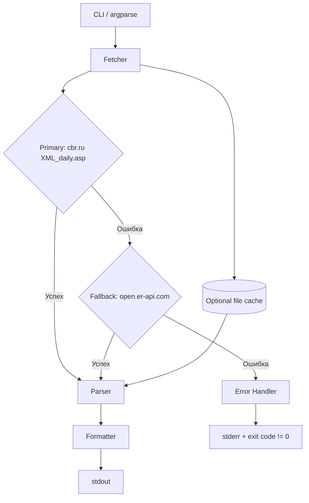

# Высокоуровневое проектирование (HLD): Скрипт USD/RUB

## 1. Общее описание решения

Скрипт `usd_rub_rate.py` — это небольшая консольная утилита на Python 3.11+, работающая исключительно на стандартной библиотеке. При запуске она запрашивает актуальный курс USD/RUB из приоритетного источника (официальный XML API ЦБ РФ), при необходимости переключается на fallback-источник, форматирует результат и выводит его в терминал. В случае невозможности получить данные выводится понятное сообщение об ошибке, процесс завершается с ненулевым кодом возврата.

## 2. Архитектура



### 2.1. Компоненты

| Компонент | Ответственность | Стандартная библиотека |
|-----------|-----------------|------------------------|
| CLI | Разбор аргументов, настройка поведения | `argparse`, `sys` |
| Fetcher | HTTP GET, таймауты, retries, fallback | `urllib.request`, `urllib.error`, `socket` |
| Parser | Извлечение курса и временной метки из XML/JSON | `xml.etree.ElementTree`, `json`, `datetime` |
| Formatter | Форматирование вывода | `datetime`, `locale` (опционально) |
| Cache | Опциональное кэширование последнего успешного ответа | `pathlib`, `json`, `tempfile` |
| Error Handler | Единообразная обработка ошибок и коды возврата | `sys` |

## 3. Выбор источников данных

### 3.1. Приоритетный источник: официальный XML API ЦБ РФ

- **URL:** `https://www.cbr.ru/scripts/XML_daily.asp`
- **Метод:** `GET`
- **Формат ответа:** XML в кодировке Windows-1251 (исторический формат ЦБ РФ).
- **Примечание:** Официальный источник курсов валют Центрального банка Российской Федерации. Публикует ежедневные официальные курсы на текущую дату. XML не содержит часовой пояс; курсы актуальны на дату публикации, обычно с 11:30 московского времени.
- **Преимущества:** Официальные данные ЦБ РФ, не требует API-ключа, неограниченный доступ.
- **Курс:** элемент `<Valute>` с `<CharCode>USD</CharCode>`, поле `<Value>`.
- **Дата актуальности:** атрибут `Date` корневого элемента `<ValCurs>` (формат `DD.MM.YYYY`).

### 3.2. Fallback-источник

- **URL:** `https://open.er-api.com/v6/latest/USD`
- **Метод:** `GET`
- **Преимущества:** публичный, без ключа, возвращает `rates.RUB`.
- **Дата актуальности:** `time_last_update_utc`.

### 3.3. Порядок использования

1. Попытка запроса к основному источнику.
2. При любой ошибке (HTTP >= 400, таймаут, сеть, некорректный XML, отсутствие USD) — переход к fallback.
3. Если и fallback недоступен — вывод ошибки и `exit(1)`.

## 4. Контракт API источников

### 4.1. ЦБ РФ (`XML_daily.asp`)

**Пример ответа:**

```xml
<?xml version="1.0" encoding="windows-1251"?>
<ValCurs Date="19.07.2026" name="Foreign Currency Market">
  <Valute ID="R01235">
    <NumCode>840</NumCode>
    <CharCode>USD</CharCode>
    <Nominal>1</Nominal>
    <Name>Доллар США</Name>
    <Value>92,4567</Value>
  </Valute>
  ...
</ValCurs>
```

**Поля, используемые скриптом:**

| Поле | Тип | Назначение |
|------|-----|------------|
| `ValCurs/Valute[CharCode='USD']/Value` | str | Курс USD/RUB (запятая как десятичный разделитель) |
| `ValCurs/@Date` | str | Дата курса (DD.MM.YYYY) |

**Парсинг:**

- HTTP-ответ читается как `bytes`.
- Кодировка ответа декодируется как `windows-1251` (fallback на `utf-8` при ошибке).
- XML парсится через `xml.etree.ElementTree.fromstring`.
- Ищется элемент `Valute`, у которого дочерний `CharCode == 'USD'`.
- Значение `Value` нормализуется: замена запятой на точку, преобразование в `float`.
- Дата `ValCurs/@Date` парсится в `datetime.date` формата `%d.%m.%Y`.

### 4.2. Open Exchange Rates API (`open.er-api.com`)

**Пример ответа:**

```json
{
  "result": "success",
  "provider": "https://www.exchangerate-api.com",
  "documentation": "https://www.exchangerate-api.com/docs/free",
  "terms_of_use": "https://www.exchangerate-api.com/terms",
  "time_last_update_unix": 1752873600,
  "time_last_update_utc": "Sat, 19 Jul 2026 00:00:00 +0000",
  "time_next_update_unix": 1752916800,
  "time_next_update_utc": "Sat, 19 Jul 2026 12:00:00 +0000",
  "time_eol_unix": 0,
  "base_code": "USD",
  "rates": {
    "RUB": 92.45
  }
}
```

**Поля, используемые скриптом:**

| Поле | Тип | Назначение |
|------|-----|------------|
| `rates.RUB` | float | Курс USD/RUB |
| `time_last_update_utc` | str | Время последнего обновления (UTC) |

## 5. Стратегия обработки ошибок

| Сценарий | Поведение |
|----------|-----------|
| Таймаут основного источника | Переход к fallback |
| HTTP 4xx/5xx от основного источника | Переход к fallback |
| Некорректный XML от основного источника | Переход к fallback |
| Отсутствует валюта USD в XML | Переход к fallback |
| Некорректное значение курса в XML | Переход к fallback |
| Недоступен fallback | Вывод ошибки в `stderr`, `exit(1)` |
| Некорректный JSON от fallback | Вывод ошибки в `stderr`, `exit(1)` |
| Отсутствует поле `rates.RUB` | Вывод ошибки в `stderr`, `exit(1)` |
| Отсутствие интернета | Вывод ошибки в `stderr`, `exit(1)` |

**Сообщение об ошибке по умолчанию:**

```
Не удалось получить курс USD/RUB. Проверьте подключение к интернету.
```

**При включённом `--verbose`:**

- Выводится краткая диагностика по каждому источнику (статус, причина отказа).

## 6. Стратегия кэширования

### 6.1. Цель

- Сократить количество внешних запросов при частом запуске.
- Показать последний известный курс, если сеть недоступна (опционально).

### 6.2. Реализация

- Кэш хранится в JSON-файле рядом со скриптом: `~/.cache/usd-rub-rate/cache.json` или `./.usd-rub-cache.json`.
- TTL по умолчанию: **5 минут**.
- Содержимое кэша: курс, источник, временная метка, дата записи.
- Поведение:
  - При запуске, если кэш валиден (не просрочен) и не указан `--no-cache`, выводится кэшированное значение без сетевого запроса.
  - При `--refresh` кэш игнорируется и обновляется после успешного запроса.
  - При недоступности сети и наличии непросроченного кэша можно вывести кэш с пометкой (опционально, защищён флагом `--use-stale`).

## 7. CLI-аргументы

| Аргумент | Тип | По умолчанию | Описание |
|----------|-----|--------------|----------|
| `--source` | str | `auto` | Принудительный выбор источника: `cbr`, `fallback`, `auto` |
| `--timeout` | float | `10.0` | Таймаут HTTP-запроса в секундах |
| `--no-fallback` | flag | `False` | Не использовать fallback-источник |
| `--no-cache` | flag | `False` | Не читать и не писать кэш |
| `--refresh` | flag | `False` | Проигнорировать кэш и обновить данные |
| `--use-stale` | flag | `False` | При сетевой ошибке использовать просроченный кэш |
| `--verbose` | flag | `False` | Подробный вывод диагностики |
| `--version` | flag | `False` | Версия скрипта |

**Примеры запуска:**

```bash
python usd_rub_rate.py
python usd_rub_rate.py --source cbr --timeout 5
python usd_rub_rate.py --refresh --verbose
python usd_rub_rate.py --no-fallback
```

## 8. Формат вывода

### 8.1. Успешный вывод

```
USD/RUB: 92.46 (источник: ЦБ РФ, дата: 2026-07-19)
```

- Курс форматируется с двумя знаками после запятой.
- Для ЦБ РФ дата — это дата из атрибута `ValCurs/@Date` (MSK, текущий операционный день ЦБ РФ).
- Для fallback-источника UTC-метка конвертируется в MSK и выводится в формате `YYYY-MM-DD HH:MM:SS MSK`.

### 8.2. Вывод при ошибке

```
Не удалось получить курс USD/RUB. Проверьте подключение к интернету.
```

### 8.3. Вывод в verbose-режиме

```
[ЦБ РФ] OK: 92.4567
USD/RUB: 92.46 (источник: ЦБ РФ, дата: 2026-07-19)
```

или

```
[ЦБ РФ] FAILED: HTTP 503
[Fallback] OK: 92.4500
USD/RUB: 92.45 (источник: open.er-api.com, дата: 2026-07-19 03:00:00 MSK)
```

## 9. Нефункциональные аспекты

| Требование | Решение |
|------------|---------|
| Stdlib-only | Используются `urllib`, `xml.etree.ElementTree`, `json`, `argparse`, `datetime`, `sys`, `pathlib`, `tempfile` |
| Размер файла | Целевой размер < 20 КБ, максимум < 50 КБ |
| Время отклика | Общий таймаут не более 10 с с возможностью переопределения |
| Кодировка | UTF-8 для входных и выходных потоков; XML-ответ декодируется как windows-1251 |
| Безопасность | Нет секретов, ключей и персональных данных |
| Среда выполнения | Python 3.11+; stdlib-only, поэтому работает и в системном Python, и в venv |

## 9a. Развёртывание и среда разработки

### Локальная разработка

- Создать venv в папке проекта:
  ```bash
  python3 -m venv .venv
  source .venv/bin/activate
  ```
- Поскольку решение stdlib-only, `requirements.txt` не требуется.
- Для линтинга/форматирования (опционально) можно установить `ruff`/`mypy` в venv, но эти зависимости не нужны для runtime.

### Production / target runtime

- Целевой хост: сервер с Python 3.11+.
- Рекомендуемый способ запуска:
  ```bash
  /path/to/project/.venv/bin/python /path/to/project/scripts/usd_rub_rate.py
  ```
- Альтернативно: `chmod +x scripts/usd_rub_rate.py` и прямой вызов через shebang.
- Для регулярного запуска — cron-задание или systemd unit.
- Скрипт портативен: не зависит от Hermes-окружения, секретов/API-ключей не требует.

## 10. Структура скрипта

```
usd_rub_rate.py
├── __version__
├── SOURCES: dict[str, SourceConfig]
├── fetch(url, timeout) -> bytes
├── parse_cbr(data: bytes) -> RateResult
├── parse_fallback(data: bytes) -> RateResult
├── get_rate(source, timeout, use_cache, refresh) -> RateResult
├── format_output(result: RateResult) -> str
├── main(argv) -> int
└── if __name__ == "__main__": sys.exit(main())
```

## 11. Коды возврата

| Код | Значение |
|-----|----------|
| `0` | Успех, курс получен и выведен |
| `1` | Ошибка получения данных из всех источников |
| `2` | Ошибка разбора аргументов командной строки |

## 12. Открытые вопросы и риски

| # | Вопрос / риск | Митигация |
|---|---------------|-----------|
| 1 | ЦБ РФ может изменить URL или структуру ответа | Версионирование скрипта, unit-тест на парсинг XML, fallback |
| 2 | Fallback-API может ограничить частоту запросов | Кэширование, минимальное количество запросов |
| 3 | Отсутствие интернета | Понятное сообщение об ошибке, опциональный stale-кэш |
| 4 | Часовые пояса | Явное преобразование fallback-меток в MSK; для ЦБ РФ используется операционная дата |
| 5 | Кодировка XML windows-1251 | Явный decode с fallback на utf-8 |

## 13. Предложения по тестированию

| # | Тест | Ожидаемый результат |
|---|------|---------------------|
| T1 | Успешный запуск без аргументов | Вывод `USD/RUB: XX.XX ...` с кодом 0 |
| T2 | `--source cbr` при недоступности ЦБ | Переход к fallback, успешный вывод |
| T3 | `--no-fallback` при недоступности ЦБ | Вывод ошибки, код 1 |
| T4 | `--no-cache` | Отсутствие чтения/записи кэша |
| T5 | Некорректный XML от ЦБ РФ | Переход к fallback или ошибка |
| T6 | Проверка формата курса | Ровно два знака после запятой |
| T7 | Проверка парсинга windows-1251 | Корректное чтение `<Name>` без искажений |
| T8 | Отсутствие USD в XML ЦБ РФ | Переход к fallback |

---

**Статус:** черновик HLD готов к ревью.
