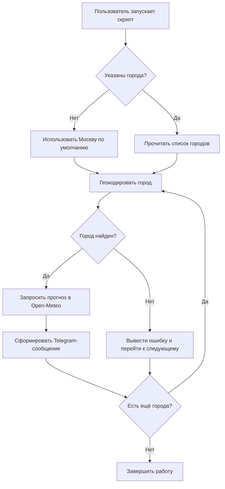

# Бизнес-требования (БФТ / BRD)

## 1. Цель доработки

Добавить в скрипт `weather_daily.py` возможность запрашивать ежедневный прогноз погоды для нескольких городов по запросу пользователя, сохранив существующий формат Telegram-сообщения.

## 2. Текущая ситуация (AS-IS)

- Скрипт `/home/hermes_ai/.hermes/scripts/weather_daily.py` жёстко привязан к Москве: широта, долгота, название города и часовой пояс заданы константами (`LAT=55.7558`, `LON=37.6173`, `CITY="Москва"`, `TIMEZONE="Europe/Moscow"`).
- Источник данных — Open-Meteo API (бесплатный, без ключа).
- Результат выводится в Telegram-формате: текущая погода + 4 периода суток (утро, день, вечер, ночь).
- Пользователь не может изменить город без редактирования кода.

## 3. Желаемое состояние (TO-BE)

- Пользователь может указать один или несколько городов, для которых нужно получить прогноз.
- Скрипт автоматически определяет координаты и часовой пояс каждого города.
- Для каждого города формируется отдельное Telegram-сообщение в текущем формате.
- Москва остаётся городом по умолчанию, если город не указан.

## 4. Бизнес-ценность

- Повышение гибкости: один скрипт покрывает потребности пользователей из разных городов.
- Снижение поддержки: отпадает необходимость поддерживать отдельные копии скрипта под каждый город.
- Сохранение UX: привычный визуальный формат сообщений не меняется.

## 5. Границы

- В рамках задачи дорабатывается только `weather_daily.py`.
- Интеграция с Telegram (отправка сообщений) не затрагивается.
- Источник данных остаётся Open-Meteo API.
- Поддержка "нескольких городов" означает список из 1..N городов, передаваемый в один запуск скрипта.

## 6. Допущения и ограничения

- Open-Meteo API доступен и не требует аутентификации.
- Геокодирование городов выполняется через открытый сервис (например, Open-Meteo Geocoding API или аналогичный бесплатный источник).
- Часовой пояс города определяется по координатам или берётся из API Open-Meteo (параметр `timezone=auto`).
- Название города может содержать русские или латинские символы.
- Максимальное количество городов в одном запуске ограничено 10 (см. BRULE-02).

## 7. Глоссарий

| Термин | Описание |
|---|---|
| Open-Meteo | Бесплатный API прогноза погоды |
| Геокодирование | Преобразование названия города в координаты (широта/долгота) |
| WMO code | Стандартный код погоды Всемирной метеорологической организации |
| Период суток | Утро (06-12), день (12-18), вечер (18-24), ночь (00-06) |

## 8. User story

**Я, как** пользователь ежедневного прогноза погоды,  
**хочу** запросить прогноз сразу для нескольких городов (например, Москва, Санкт-Петербург, Казань),  
**чтобы** получить актуальную сводку погоды для себя, родственников или планирования поездок.

### Acceptance criteria

1. При запуске без параметров скрипт возвращает прогноз для Москвы.
2. При запуске со списком городов скрипт возвращает прогноз для каждого города.
3. Для каждого города сообщение содержит текущую погоду и 4 периода суток.
4. Если город не найден — скрипт сообщает об ошибке по этому городу и продолжает обработку остальных.
5. Формат сообщения соответствует текущему Telegram-формату.

## 9. Клиентский путь (CJM)

## 10. Нормативные требования (REG-NN)

REG-01 | Использование открытых данных: при использовании Open-Meteo и сторонних геокодеров необходимо соблюдать их Terms of Use и ограничения по rate-limit.

*Источник:* условия использования Open-Meteo API.

## 11. Бизнес-требования (BR-NN)

| Код | Требование | Acceptance criteria | Приоритет |
|---|---|---|---|
| BR-01 | Скрипт должен поддерживать передачу списка городов через аргументы командной строки | `python weather_daily.py Москва "Санкт-Петербург" Казань` возвращает прогноз для 3 городов | Must |
| BR-02 | Москва должна использоваться как город по умолчанию | Запуск без аргументов возвращает прогноз для Москвы | Must |
| BR-03 | Для каждого указанного города должно формироваться отдельное сообщение | Каждый город выводится как самостоятельное Telegram-сообщение в текущем формате | Must |
| BR-04 | Скрипт должен геокодировать название города в координаты | Название города преобразуется в latitude/longitude перед запросом погоды | Must |
| BR-05 | Обработка ошибок геокодирования не должна прерывать выполнение для остальных городов | Если один город не найден — выводится ошибка, остальные города обрабатываются | Should |
| BR-06 | Название города в выводе должно совпадать с запрошенным или использоваться официальное название из геокодера | Сообщение содержит корректное название города на русском или латинском языке | Should |

## 12. Бизнес-правила (BRULE-NN)

| Код | Правило | Источник |
|---|---|---|
| BRULE-01 | Если список городов пуст, используется Москва | Требование пользователя сохранить текущее поведение |
| BRULE-02 | Максимальное количество городов в одном запуске — 10 | NFR-03 (лимит на потребление API и длину вывода) |
| BRULE-03 | Города обрабатываются в порядке, указанном пользователем | UX-соглашение о предсказуемости вывода |
| BRULE-04 | Названия городов чувствительны к регистру только в части отображения; при геокодировании поиск выполняется без учёта регистра | Стандартное поведение строковых поисков |
| BRULE-05 | Если геокодирование вернуло несколько результатов, выбирается первый (наиболее релевантный) | Практика работы с геокодерами |

## 13. Нефункциональные требования (NFR-NN)

| Код | Требование | Метрика |
|---|---|---|
| NFR-01 | Доступность | Скрипт должен работать при доступности Open-Meteo API ≥ 95% |
| NFR-02 | Производительность | Общее время выполнения для 1 города ≤ 5 сек; для 10 городов ≤ 30 сек |
| NFR-03 | Надёжность | При ошибке по одному городу остальные города продолжают обрабатываться; код возврата ≠ 0, если хотя бы один город завершился ошибкой |
| NFR-04 | Потребление внешних API | Использовать не более 1 вызова геокодера и 1 вызова прогноза погоды на город |
| NFR-05 | Удобство сопровождения | Новая функциональность покрыта логированием/обработкой исключений; изменения не ломают существующий запуск по умолчанию |
| NFR-06 | Безопасность | Токены/ключи не требуются; пользовательский ввод валидируется перед передачей в URL |

## 14. Риски (R-NN)

| Код | Риск | Вероятность | Влияние | Митигация |
|---|---|---|---|---|
| R-01 | Бесплатный геокодер имеет rate-limit или недоступен | Средняя | Среднее | Иметь fallback на локальный кэш координат; либо кэшировать координаты после первого успешного запроса |
| R-02 | Геокодер возвращает неоднозначный результат (например, "Самара" — Россия или Испания) | Средняя | Низкое | BRULE-05: выбирать первый результат; в будущем можно добавить уточнение региона |
| R-03 | Изменение формата ответа Open-Meteo | Низкая | Среднее | Сохранить существующую обработку ответа; добавить проверки ключей |
| R-04 | Длинный список городов приводит к большому выводу | Низкая | Низкое | BRULE-02: ограничить количество городов |

## 15. Заинтересованные стороны и зависимости

| Роль | Интерес |
|---|---|
| Пользователь Telegram-бота | Получать прогноз для нужных городов |
| Разработчик (Implementer) | Реализовать геокодирование и обработку списка городов |
| QA / Tester | Проверить корректность вывода и обработку ошибок |
| DevOps / Maintainer | Обеспечить стабильную работу cron-задания, если скрипт запускается по расписанию |

**Зависимости:**
- Доступность Open-Meteo API.
- Доступность сервиса геокодирования (Open-Meteo Geocoding API или аналог).
- Наличие интернет-соединения на хосте.

## 16. Предпосылки для системных требований

Для перехода к техническому проектированию необходимо зафиксировать:

1. Выбранный сервис геокодирования (рекомендуется Open-Meteo Geocoding API `https://geocoding-api.open-meteo.com/v1/search`).
2. Способ передачи списка городов (аргументы командной строки, переменная окружения или конфиг-файл).
3. Требуется ли кэширование координат городов.
4. Формат вывода при ошибке по отдельному городу.

## 17. DoR / DoD

### Definition of Ready (DoR)

| # | Критерий | Статус |
|---|---|---|
| D1 | Бизнес-заказчик идентифицирован (пользователь ежедневного прогноза) | ✅ |
| D2 | Проблема описана (AS-IS + TO-BE) | ✅ |
| D3 | Цель описана | ✅ |
| D4 | User story с acceptance criteria | ✅ |
| D5 | CJM / BPMN присутствует | ✅ |
| D6 | Заинтересованные стороны и департаменты перечислены | ✅ |
| D7 | Системы / сервисы идентифицированы | ✅ |
| D12 | NFR на потребление API | ✅ |
| D13 | NFR на производительность | ✅ |
| D14 | Присутствует хотя бы одно BR | ✅ |

**DoR: 10/10 обязательных пройдено → ГОТОВ**

### Definition of Done (DoD)

| # | Критерий | Статус |
|---|---|---|
| DD1 | Все разделы БФТ заполнены | ✅ |
| DD2 | Каждое BR имеет acceptance criteria | ✅ |
| DD3 | Каждое бизнес-правило имеет источник | ✅ |
| DD4 | Каждое REG имеет регуляторный источник | ✅ |
| DD5 | Нет блокирующих открытых вопросов | ✅ |
| DD6 | Заинтересованные стороны заполнены | ✅ |
| DD7 | Предпосылки для системных требований заполнены | ✅ |
| DD8 | Требуется ревью бизнес-заказчика | ⏳ (HUMAN GATE) |
| DD9 | MD-файл сохранён в проекте | ✅ |

**DoD: 9/10**

*Примечание:* DD8 (HUMAN GATE) требует подтверждения пользователя перед передачей задачи на реализацию.

## 18. Открытые вопросы

| # | Вопрос | Ответственный |
|---|---|---|
| 1 | Подтвердить лимит в 10 городов за один запуск | Бизнес-заказчик |
| 2 | Подтвердить использование Open-Meteo Geocoding API в качестве источника координат | Бизнес-заказчик / Разработчик |
| 3 | Нужно ли кэширование координат для часто запрашиваемых городов | Бизнес-заказчик |
| 4 | Требуется ли поддержка иностранных городов и латиницы в названиях | Бизнес-заказчик |

---
*Документ подготовлен BA sub-agent в рамках мультиагентного pipeline разработки.*
