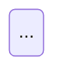

# Data Model Generator (Hermes)

## Purpose

Build a structured data model report from:
- A Markdown technical specification (`source-spec.md` or similar)
- An existing database schema file (`schema.js`, `.sql`, or ORM definitions)

Useful when there is no Swagger/OpenAPI, but the spec describes tables/entities and the code already has a real schema.

## When to Use

- User says: "собери модель данных", "ER-диаграмма", "data model", "схема БД".
- Source spec and schema file paths are provided or known.
- Called by `system-analyst` or `quality-gate` to document/verify data model.

## Input

1. Path to Markdown specification.
2. Path to schema file (`.js`, `.sql`, `.prisma`, `.py` model).
3. Project workdir for saving output.

## Not Supported

- Swagger/OpenAPI parsing.
- Confluence/Jira integration.
- Automatic schema migration generation.

## Lookup Order

1. `MemorySearch` / `MemoryFetch` — if model was already generated.
2. Local `docs/data-model.md` if exists.
3. Read spec + schema and generate fresh.

## Workflow

### Step 1: Load sources

- `read_file(spec_path)`
- `read_file(schema_path)`

If schema is JS/TS, extract table definitions by parsing strings or AST via `execute_code`.

### Step 2: Extract entities from schema

For each table:
- Name
- Columns: name, type, nullable, default, PK/FK/index
- Constraints
- Foreign keys
- Triggers / migrations (if present)

### Step 3: Extract data model hints from spec

From the Markdown spec, capture:
- Tables mentioned by name
- Columns described
- Status fields and their allowed values
- Relationships (one-to-many, many-to-many)
- Business rules affecting data integrity

### Step 4: Cross-check spec vs schema

| Check | Description |
|-------|-------------|
| Table in spec but missing in schema | Spec claims table exists |
| Table in schema but not in spec | Undocumented table |
| Column mismatch | Type/nullability differs |
| Missing FK / index | Relationship or constraint absent |
| Status values differ | ENUM/status list inconsistent |

### Step 5: Build ER diagram

Generate Mermaid `erDiagram`:
- Entities with `name type` fields (ER field order: name then type)
- Relationships with cardinality (`||--o{`, `||--||`)
- PK/FK notation in comments

### Step 6: Entity tables

For each entity:

```markdown
### <table_name>

| Parameter | Description | Required | Type | Comment |
|-----------|-------------|----------|------|---------|
| id | Primary key | Y | TEXT | UUIDv4, PK |
| ... | ... | ... | ... | ... |
```

### Step 7: State machines

For tables with status fields (e.g., `runs.status`, `profiles.status`), build:
- Mermaid state diagram
- Transition table: from → to → condition

### Step 8: Idempotency and uniqueness

Document:
- Unique constraints
- Composite keys
- Natural keys used for upsert/idempotency
- How duplicates are prevented

### Step 9: Save and persist

Save report to:
```
<workdir>/docs/data-model.md
```

Add header:
```markdown
<!-- Spec: {spec_path} | Schema: {schema_path} | Generated: YYYY-MM-DD -->
```

Call `MemoryWrite` with concise Russian summary:
- Tables count
- Key entities
- Top 3 spec-vs-schema gaps
- State machines count

## Output Document Template

```markdown
# Data Model: <Project>

<!-- Spec: ... | Schema: ... | Generated: ... -->

## 1. ER Diagram

```mermaid
erDiagram
    ...
```

## 2. Entities

### <table>

| Parameter | Description | Required | Type | Comment |
|-----------|-------------|----------|------|---------|
| ... | ... | Y/N | ... | ... |

## 3. State Machines

### <entity> status



| From | To | Condition |
|------|----|-----------|
| ... | ... | ... |

## 4. Idempotency / Uniqueness

...

## 5. Spec vs Schema Gaps

| # | Type | Description | Severity |
|---|------|-------------|----------|
| ... | ... | ... | ... |

## 6. Open Questions

| # | Question | Impact |
|---|----------|--------|
| ... | ... | ... |
```

## Language

- Output artifacts in Russian.
- Table/column names and technical identifiers remain as in code.

## Anti-patterns

- Do NOT invent tables not present in schema or spec.
- Do NOT assume PostgreSQL if schema is SQLite.
- Do NOT duplicate full schema into `~/.hermes/memories/`; use concise `MemoryWrite`.
- Do NOT skip the spec-vs-schema cross-check.

## Tool Usage

- `read_file` — spec and schema.
- `execute_code` — parse JS/TS schema if needed.
- `write_file` — save report.
- `MemoryWrite`, `MemorySearch` — persistence and recall.
